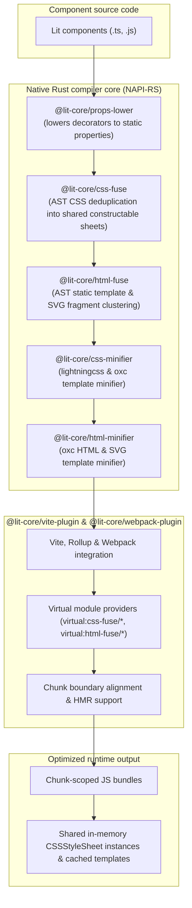

# lit-core

> Ahead-of-time compiler and bundler optimization toolchain for Lit and Web Components

`@lit-core` is an ahead-of-time (AOT) toolchain designed to optimize Web Component applications. It addresses key performance overheads in modern Web Component architectures—including duplicate styles inside Shadow DOM, runtime decorator reflection, and unoptimized template literals—at compile time.



---

## Architectural motivation

Web Components isolate styles within Shadow DOM. While this prevents global style leakage, it introduces architectural challenges for application performance:

1. **Style duplication across shadow roots**:
   Traditional CSS utility engines cannot cross shadow boundaries without template rewrites. As a result, design systems often duplicate hundreds of lines of resets, design tokens, layout helpers, and component base rules inside every single component's stylesheet.
2. **Template and SVG fragment duplication**:
   Components across a design system repeat identical static SVG icons, carets, focus rings, slot wrappers, and helper text containers. Standard bundling duplicates these subtrees and forces browsers to repeatedly parse and cache identical DOM trees.
3. **Runtime decorator overhead**:
   Standard Lit decorators (`@property()`, `@state()`, `@query()`) rely on experimental decorator metadata and runtime reflection polyfills, bloating bundle size and delaying boot time.
4. **Template opacity in standard minifiers**:
   Standard bundler minifiers often treat Lit `css` and `html` tagged template literals as plain strings, leaving excess whitespace, unminified CSS declarations, and redundant markup.

---

## How it works

`@lit-core` solves these issues ahead of time using native Rust AST analysis and bundler orchestration:

1. **AST CSS deduplication (`@lit-core/css-fuse`)**:
   - Parses component styles at the AST level using `oxc` and `lightningcss`.
   - Identifies identical CSS rules and declaration blocks across components.
   - Extracts shared rules into virtual modules (`virtual:css-fuse/*`) exporting Lit `css` tagged template strings.
   - At runtime, shared sheets instantiate a single constructable `CSSStyleSheet` object shared across components in browser memory.
   - Preserves cascade order and specificity by prepending shared sheets before local overrides (`static styles = [sharedRuleSet, localStyles]`).
2. **AST HTML and SVG fragment clustering (`@lit-core/html-fuse`)**:
   - Parses static HTML and SVG subtrees inside Lit `html` and `svg` templates using `oxc`.
   - Identifies duplicate icon markup, carets, focus rings, and slot wrappers across components.
   - Clusters identical subtrees into hash-addressed virtual modules (`virtual:html-fuse/*`) exporting shared templates.
   - Leverages `lit-html`'s frozen `TemplateStringsArray` caching so the browser only parses `innerHTML` once.
3. **AOT Lit decorator lowering (`@lit-core/props-lower`)**:
   - Compiles `@property()` and `@state()` decorators into standard static `properties` fields ahead of time.
   - Transforms `@query()`, `@queryAll()`, and `@eventOptions()` into efficient getters and prototype bindings.
   - Eliminates runtime decorator polyfills and reflection libraries.
4. **High-speed template minification (`@lit-core/css-minifier`, `@lit-core/html-minifier`)**:
   - Minifies embedded CSS within Lit `css` template literals via `lightningcss`.
   - Strips whitespace, comments, and redundant tokens from Lit `html` and `svg` templates using `oxc` AST walking without touching interpolation holes.
5. **Unified bundler integration (`@lit-core/vite-plugin`, `@lit-core/webpack-plugin`)**:
   - Connects all native compilation passes into Vite, Rollup, and Webpack pipelines.
   - Scopes shared constructable stylesheets and virtual templates to bundler chunk boundaries.
   - Provides fine-grained Hot Module Replacement (HMR) for individual stylesheets without full page reloads.

---

## Packages

| Package | Path | Tech stack | Purpose |
| :--- | :--- | :--- | :--- |
| [`@lit-core/css-fuse`](packages/css-fuse/) | `packages/css-fuse` | Rust (`oxc`, `lightningcss`), NAPI-RS | Cross-component CSS deduplication into shared constructable sheets |
| [`@lit-core/html-fuse`](packages/html-fuse/) | `packages/html-fuse` | Rust (`oxc`), NAPI-RS | Cross-component static HTML and SVG fragment clustering |
| [`@lit-core/props-lower`](packages/props-lower/) | `packages/props-lower` | Rust (`oxc`), NAPI-RS | AOT Lit decorator and property lowering |
| [`@lit-core/css-minifier`](packages/css-minifier/) | `packages/css-minifier` | Rust (`oxc`, `lightningcss`), NAPI-RS | High-speed CSS template literal minification |
| [`@lit-core/html-minifier`](packages/html-minifier/) | `packages/html-minifier` | Rust (`oxc`), NAPI-RS | High-speed HTML and SVG template literal minification |
| [`@lit-core/html-aot`](packages/html-aot/) | `packages/html-aot` | TypeScript, `parse5`, `lit-html` | Ahead-of-time Lit template compilation eliminating runtime prepare phase |
| [`@lit-core/vite-plugin`](packages/vite-plugin/) | `packages/vite-plugin` | TypeScript, Vite / Rollup | Bundler plugin unifying all `@lit-core` optimizations |
| [`@lit-core/webpack-plugin`](packages/webpack-plugin/) | `packages/webpack-plugin` | TypeScript, Webpack | Bundler plugin unifying all `@lit-core` optimizations for Webpack |
| [`@lit-core/benchmarks`](packages/benchmarks/) (private) | `packages/benchmarks` | Node.js, Vite | Empirical benchmark harness evaluating bundle reductions |

---

## Empirical benchmarks

The `@lit-core/benchmarks` harness evaluates bundle size reductions across popular production Lit component libraries:

- **Web Awesome** (`@awesome.me/webawesome`): 73 components evaluated across full-suite bundles.
- **Carbon Web Components** (`@carbon/web-components`): Enterprise design system components (99 elements).
- **Adobe Spectrum** (`@spectrum-web-components/bundle`): Complex interactive UI suites (52 elements).
- **Momentum Design** (`@momentum-design/components`): Cisco Momentum Design components (97 elements).
- **Material Web** (`@material/web`): Google Material 3 components (28 elements).

Running the full suite demonstrates significant cumulative bundle reductions through shared stylesheet instantiation and native template minification.

---

## Getting started

### Prerequisites

- Node.js `>= 24`
- `pnpm >= 11`
- Rust toolchain (`cargo`, `rustc`) for compiling native NAPI-RS bindings

### Installation

```bash
# Clone the repository
git clone https://github.com/lit-core/core.git
cd core

# Install dependencies
pnpm install
```

### Building native modules and packages

```bash
pnpm run build
```

### Running tests

```bash
# Run all workspace test suites
pnpm run test

# Run bundler integration tests
node packages/vite-plugin/test/integration.test.js
```

### Running benchmarks

```bash
# Run all benchmark suites
pnpm run benchmark

# Run the Web Awesome benchmark suite
pnpm run benchmark:webawesome

# Run the Momentum Design benchmark suite
pnpm run benchmark:momentum

# Output benchmark comparison tables in Markdown
pnpm run benchmark:markdown
```

---

## Available scripts

- `pnpm run build`: Compile all native Rust crates and build TypeScript packages via Turborepo.
- `pnpm run test`: Execute unit and integration tests across all packages.
- `pnpm run lint`: Check code quality and formatting with Biome.
- `pnpm run format`: Format JavaScript, TypeScript, and JSON files with Biome.
- `pnpm run benchmark`: Run the multi-suite bundler optimization benchmarks.
- `pnpm run benchmark:webawesome`: Benchmark bundle size impact on Web Awesome components.
- `pnpm run benchmark:momentum`: Benchmark bundle size impact on Momentum Design components.
- `pnpm run benchmark:markdown`: Print formatted benchmark impact tables in Markdown.
- `pnpm run clean`: Remove build artifacts, target folders, and cache directories.

---

## Safety invariants

1. **Cascade and specificity preservation**:
   Shared constructable stylesheets are prepended before component local overrides (`static styles = [sharedSheet, localOverrides]`). Selector specificity and order are never altered.
2. **Module graph alignment**:
   Shared stylesheets strictly respect Rollup chunk boundaries to ensure lazy-loaded component styles do not leak into entry chunks.
3. **Net savings threshold**:
   Clustering rules enforce a net savings threshold so virtual module import overhead never exceeds CSS bytes saved.

---

## License

MIT © lit-core
