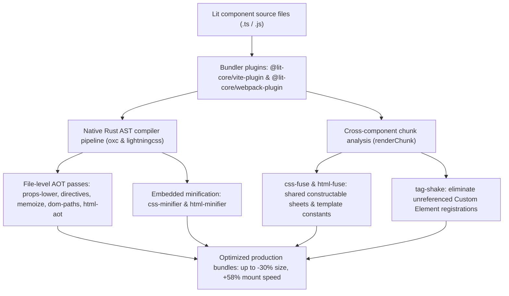

# lit-core

> High-performance ahead-of-time (AOT) compiler toolchain and delivery architecture for Lit and Web Components.

---

## Introduction

### What is it?

`@lit-core` is an ahead-of-time (AOT) compilation toolchain and bundler optimization suite designed for Lit and Web Component applications. It shifts heavy runtime responsibilities—including CSS deduplication, decorator reflection, directive evaluation, DOM traversal, and template preparation—from client devices to build time.

### Why does it exist?

Web Components offer standards-based encapsulation via the Shadow DOM, but that encapsulation creates severe architectural friction at scale:
- **Redundant styles**: Because global utility stylesheets cannot pierce shadow boundaries, design systems duplicate design tokens, resets, and typography in every component's `static styles`. In IBM Carbon Web Components, over 50% of the entire package size is duplicate CSS declarations.
- **Runtime reflection**: Standard TypeScript decorators (`@property`, `@state`, `@customElement`) require runtime metadata helpers (`tslib`) and dynamic reflection during module load.
- **Hydration and mount bottlenecks**: Standard Lit mounts clone templates and traverse the entire DOM tree via `TreeWalker` to discover binding markers, and Server-Side Rendering (SSR) incurs high Total Blocking Time (TBT) during upfront hydration.

### How does it work?

`@lit-core` intervenes during the build phase (via Vite, Rollup, or Webpack) with native Rust AST transforms powered by `oxc` and `lightningcss`:
1. **Deduplicates CSS ASTs**: Extracts repeated CSS declaration blocks into shared constructable stylesheets (`virtual:css-fuse/*`) instantiated once in browser memory.
2. **Lowers decorators and directives**: Compiles decorators to standard static `properties` and lowers 21 built-in Lit directives into zero-allocation JavaScript primitives.
3. **Optimizes DOM mounting**: Precomputes structural child pointer paths (`dom-paths`) and hoists event listeners to the ShadowRoot (`event-hoist`).
4. **Enables interaction-driven resumption**: Renders Declarative Shadow DOM on the server and defers component JavaScript download until first user interaction (`resumable`).

---

## Architecture

### Big picture

---

## Packages

### Compiler passes and optimizations

| Package | Purpose |
| :--- | :--- |
| [`@lit-core/css-fuse`](packages/css-fuse/README.md) | Cross-component CSS deduplication into shared constructable sheets |
| [`@lit-core/props-lower`](packages/props-lower/README.md) | AOT Lit decorator and reactive property lowering |
| [`@lit-core/html-fuse`](packages/html-fuse/README.md) | Static HTML and SVG fragment clustering into shared template constants |
| [`@lit-core/event-hoist`](packages/event-hoist/README.md) | Ahead-of-time ShadowRoot event delegation |
| [`@lit-core/dom-paths`](packages/dom-paths/README.md) | Ahead-of-time structural DOM path compiler eliminating TreeWalker mounting traversal |
| [`@lit-core/dirty-mask`](packages/dirty-mask/README.md) | Ahead-of-time property-to-part dependency bitmasking with `noChange` short-circuiting |
| [`@lit-core/directives`](packages/directives/README.md) | Ahead-of-time Lit directive lowering compiler eliminating runtime wrapper allocations |
| [`@lit-core/memoize`](packages/memoize/README.md) | Ahead-of-time reactive expression auto-memoization for pure array pipelines |
| [`@lit-core/elem-proxy`](packages/elem-proxy/README.md) | Deferred custom element stubs and JIT class upgrade |
| [`@lit-core/html-aot`](packages/html-aot/README.md) | Ahead-of-time Lit template compilation into static descriptors |
| [`@lit-core/native`](packages/native/README.md) | Ahead-of-time vanilla Web Component and micro-runtime compiler |
| [`@lit-core/css-minifier`](packages/css-minifier/README.md) | Embedded CSS template literal minification via `lightningcss` |
| [`@lit-core/html-minifier`](packages/html-minifier/README.md) | Embedded HTML and SVG template literal minification via `oxc` |
| [`@lit-core/resumable`](packages/resumable/README.md) | Zero-JavaScript SSR and interaction-driven runtime resumption |
| [`@lit-core/tag-shake`](packages/tag-shake/README.md) | Ahead-of-time Web Component dead code elimination and registration tag shaking |

### Bundler plugins

| Package | Purpose |
| :--- | :--- |
| [`@lit-core/vite-plugin`](packages/vite-plugin/README.md) | Unified Vite and Rollup plugin integrating all `@lit-core` optimizations |
| [`@lit-core/webpack-plugin`](packages/webpack-plugin/README.md) | Unified Webpack 5 plugin integrating all `@lit-core` optimizations |

### Benchmarks, testing, and showcase

| Package | Purpose |
| :--- | :--- |
| [`@lit-core/benchmarks`](packages/benchmarks/README.md) | Empirical benchmark harness and interactive React viewer across 5 design systems |
| [`@lit-core/tests`](packages/tests/README.md) | Real component multi-framework Playwright test suite (2,305 browser tests) |
| [`@lit-core/test-kit`](packages/test-kit/README.md) | Sandbox-safe Playwright Chromium runner and Shadow DOM testing utilities |
| [`@lit-core/showcase`](packages/showcase/README.md) | Multi-framework component showcase with isolated compiler passes |

---

## Empirical performance

Evaluated across 20 canonical components from 5 enterprise design systems (Carbon Web Components, Spectrum Web Components, Web Awesome, Momentum Design, Material Web):

| Metric | Baseline production build | With `@lit-core` full suite | Measured improvement |
| :--- | ---: | ---: | ---: |
| Raw bundle size (Carbon) | 1,405.1 KB (1,438,781 B) | 984.2 KB (1,007,814 B) | -30.0% (-420.9 KB) |
| Gzipped bundle size (Carbon) | 181.9 KB (186,286 B) | 154.1 KB (157,788 B) | -15.3% (-27.8 KB) |
| First render mount latency (Carbon) | 96.0 ms | 40.4 ms | +57.9% faster mount |
| First render mount latency (Spectrum) | 52.3 ms | 24.7 ms | +52.8% faster mount |
| First render mount latency (Momentum) | 39.6 ms | 18.1 ms | +54.3% faster mount |
| Reactive update latency (Carbon) | 4.6 ms | 2.0 ms | +56.5% faster updates |
| Reactive update latency (Momentum) | 1.1 ms | 0.5 ms | +54.5% faster updates |
| Script eval latency (Carbon) | 4.4 ms | 4.1 ms | +6.8% faster eval |
| Script eval latency (Web Awesome) | 6.2 ms | 3.3 ms | +46.8% faster eval |
| Collection reconciliation (memoize) | 48.2 ms | 0.2 ms | -99.5% latency reduction |
| Initial JS payload on boot (SSR) | 420.5 KB | 1.2 KB | -99.6% initial download |

---

## Contributing and architecture

- [Contributing guide](CONTRIBUTING.md): Environment setup, prerequisites, building native Rust crates, and running tests.
- [Monorepo architecture guidelines](AGENTS.md): Architectural principles, safety invariants, and general-purpose design constraints.

---

## License

MIT
