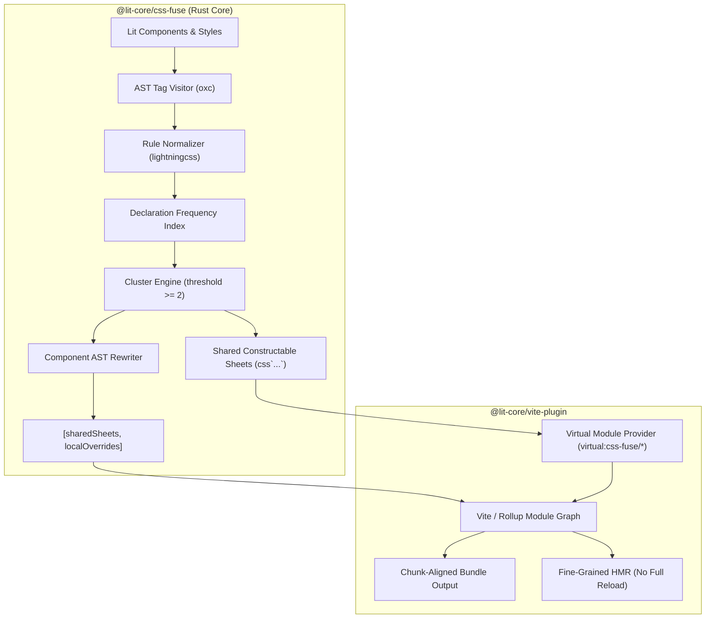

# CSS Fuse Monorepo

> **AOT Cross-Component CSS Deduplication & Constructable Stylesheet Sharing for Lit & Web Components**

This repository contains the `@lit-core` toolchain for analyzing, deduplicating, and sharing CSS rules across Web Components ahead of time (AOT).



---

## Architectural Direction

Traditional utility-class atomization requires parsing HTML templates, rewriting `class` attributes, and breaking the CSS cascade inside Shadow DOM.

`@lit-core/css-fuse` takes an **AST-driven constructable stylesheet** approach:
1. **Pure CSS AST Transform**: Scans `css` tagged template literals across components using `oxc` and `lightningcss`. Lit `html` templates and class names are completely untouched.
2. **Sub-Rule & Declaration-Level Extraction**: Detects identical CSS declaration blocks and selectors across components, extracting common rules into shared, hash-identified constructable stylesheet modules.
3. **Local Override Preservation**: Retains unique rules and component-specific overrides in the component's local stylesheet.
4. **Order & Specificity Preservation**: Updates component `static styles` arrays by prepending shared sheets before local styles (`static styles = [sharedRuleSet, localStyles]`), strictly preserving cascade precedence without altering specificity.
5. **Constructable Stylesheet Instance Sharing**: Consuming components share identical `CSSStyleSheet` instances in memory, eliminating redundant style compilation in browser engines.
6. **Chunk-Aware Scoping**: The Vite plugin connects with Rollup's module graph to ensure shared stylesheets are co-located with their consuming components, preventing lazy-route styles from leaking into entry bundles.

---

## Monorepo Workspaces

| Package | Description | Language / Tech |
|---|---|---|
| [`@lit-core/css-fuse`](packages/css-fuse/) | Core AOT deduplication engine, normalizer, and scoping auditor | Rust (`oxc`, `lightningcss`, `blake3`) + NAPI-RS |
| [`@lit-core/vite-plugin`](packages/vite-plugin/) | Official Vite / Rollup plugin with configurable css-fuse AST deduplication | TypeScript + Vite / Rollup |
| [`@lit-core/benchmarks`](packages/benchmarks/) (private) | Multi-tool optimization benchmark runner and size impact reporting | Node.js + Vite |

---

## Quick Start

### Prerequisites
- Node.js >= 20
- pnpm >= 10
- Rust toolchain (cargo, rustc) for compiling native bindings

### Installation

```bash
pnpm install
```

### Build Everything

```bash
pnpm run build
```

### Run Tests

```bash
# Run all workspace test suites (Rust unit/integration tests + Vite bundler tests)
pnpm run test
```

### Run Bundle Benchmarks

Evaluate bundle size reduction, individual tool impacts, and combined totals across multiple component suites (see [`@lit-core/benchmarks` README](packages/benchmarks/README.md) for full metrics and documentation):

```bash
# Run all benchmark suites with breakdown tables
pnpm run benchmark

# Run the Web Awesome full suite benchmark
pnpm run benchmark:webawesome

# Output markdown tables
pnpm run benchmark:markdown
```

---

## Available Scripts

- `pnpm run build`: Build all workspaces using Turborepo.
- `pnpm run test`: Run the full test suite across Rust and TypeScript packages.
- `pnpm run benchmark`: Run the multi-suite bundler optimization benchmarks with impact tables.
- `pnpm run benchmark:webawesome`: Run the bundle comparison benchmark on Web Awesome.
- `pnpm run benchmark:markdown`: Output benchmark comparison tables in Markdown format.
- `pnpm run clean`: Clean all build artifacts, targets, and turbo caches.
- `pnpm run format`: Format source files with Biome.

---

## License

MIT © Jonathan Rawlings
