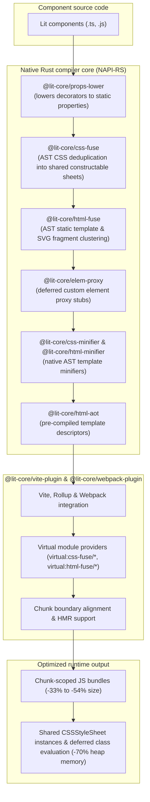

# lit-core

> Ahead-of-time compiler and bundler optimization toolchain for Lit and Web Components

`@lit-core` is an ahead-of-time (AOT) toolchain designed to optimize Web Component applications. It addresses key performance overheads in modern Web Component architectures—including duplicate styles inside Shadow DOM, runtime decorator reflection, eager class registration, and unoptimized template literals—at compile time.



---

## Architectural motivation

Web Components isolate styles within Shadow DOM. While this prevents global style leakage, it introduces architectural challenges for application performance:

1. **Style duplication across shadow roots**:
   Traditional CSS utility engines cannot cross shadow boundaries without template rewrites. As a result, design systems often duplicate hundreds of lines of resets, design tokens, layout helpers, and component base rules inside every single component's stylesheet.
2. **Template and SVG fragment duplication**:
   Components across a design system repeat identical static SVG icons, carets, focus rings, slot wrappers, and helper text containers. Standard bundling duplicates these subtrees and forces browsers to repeatedly parse and cache identical DOM trees.
3. **Runtime decorator overhead**:
   Standard Lit decorators (`@property()`, `@state()`, `@query()`) rely on experimental decorator metadata and runtime reflection polyfills, bloating bundle size and delaying boot time.
4. **Eager script evaluation cost**:
   Importing component suites eagerly parses and instantiates classes, reactive properties, and constructable stylesheets for every element, consuming substantial CPU time and V8 heap memory even for elements that are never rendered.
5. **Template opacity in standard minifiers**:
   Standard bundler minifiers often treat Lit `css` and `html` tagged template literals as plain strings, leaving excess whitespace, unminified CSS declarations, and redundant markup.

---

## How it works

`@lit-core` solves these issues ahead of time using native Rust AST analysis and bundler orchestration:

1. **AST CSS deduplication ([`@lit-core/css-fuse`](packages/css-fuse/))**:
   - Parses component styles at the AST level using `oxc` and `lightningcss`.
   - Extracts shared rules into virtual modules (`virtual:css-fuse/*`) exporting Lit `css` tagged template strings.
   - At runtime, shared sheets instantiate a single constructable `CSSStyleSheet` object shared across components in browser memory.
   - Preserves cascade order and specificity by prepending shared sheets before local overrides (`static styles = [sharedSheet, localStyles]`).
   - Deep dive: [CSS deduplication architecture](packages/css-fuse/docs/architecture.md) and [Shadow DOM scoping audit](packages/css-fuse/docs/scoping-audit.md).
2. **AST HTML and SVG fragment clustering ([`@lit-core/html-fuse`](packages/html-fuse/))**:
   - Parses static HTML and SVG subtrees inside Lit `html` and `svg` templates using `oxc`.
   - Clusters identical subtrees into hash-addressed virtual modules (`virtual:html-fuse/*`) exporting shared templates.
   - Leverages `lit-html`'s frozen `TemplateStringsArray` caching so the browser only parses `innerHTML` once.
   - Deep dive: [Static fragment clustering guide](packages/html-fuse/docs/fragment-clustering.md).
3. **AOT Lit decorator lowering ([`@lit-core/props-lower`](packages/props-lower/))**:
   - Compiles `@property()` and `@state()` decorators into standard static `properties` fields ahead of time.
   - Transforms `@query()`, `@queryAll()`, and `@eventOptions()` into efficient getters and prototype bindings.
   - Eliminates runtime decorator polyfills and reflection libraries.
   - Deep dive: [Decorator lowering mechanics](packages/props-lower/docs/transform-mechanics.md).
4. **AOT deferred element proxying ([`@lit-core/elem-proxy`](packages/elem-proxy/))**:
   - Replaces eager Custom Element registration with lightweight proxy stubs.
   - Defers class evaluation and stylesheet creation until an element is mounted in the DOM or touched via JavaScript property access.
   - Preserves prototype chains and `instanceof` checks with zero layout shifts.
   - Deep dive: [Deferred proxy architecture](packages/elem-proxy/docs/proxy-architecture.md).
5. **Ahead-of-time template compilation ([`@lit-core/html-aot`](packages/html-aot/))**:
   - Pre-compiles Lit templates into pre-parsed template descriptors with pre-calculated part indices.
   - Eliminates the runtime HTML parsing and template preparation phase, delivering up to **+38% faster initial render times**.
   - Deep dive: [AOT template compilation guide](packages/html-aot/docs/template-compilation.md).
6. **Native template minification ([`@lit-core/css-minifier`](packages/css-minifier/), [`@lit-core/html-minifier`](packages/html-minifier/))**:
   - Minifies embedded CSS within Lit `css` template literals via `lightningcss`.
   - Strips whitespace, comments, and redundant tokens from Lit `html` and `svg` templates using `oxc` AST walking without touching interpolation holes.
7. **Unified bundler integration ([`@lit-core/vite-plugin`](packages/vite-plugin/), [`@lit-core/webpack-plugin`](packages/webpack-plugin/))**:
   - Connects all native compilation passes into Vite, Rollup, and Webpack pipelines.
   - Scopes shared constructable stylesheets and virtual templates to bundler chunk boundaries.
   - Provides fine-grained Hot Module Replacement (HMR) for individual stylesheets without full page reloads.
   - Deep dive: [Vite configuration guide](packages/vite-plugin/docs/configuration.md), [HMR mechanics](packages/vite-plugin/docs/hmr.md), and [Webpack configuration](packages/webpack-plugin/docs/configuration.md).

---

## Packages

| Package | Path | Tech stack | Purpose | Documentation |
| :--- | :--- | :--- | :--- | :--- |
| [`@lit-core/css-fuse`](packages/css-fuse/) | `packages/css-fuse` | Rust (`oxc`, `lightningcss`), NAPI-RS | Cross-component CSS deduplication into shared constructable sheets | [Architecture](packages/css-fuse/docs/architecture.md) · [Scoping audit](packages/css-fuse/docs/scoping-audit.md) |
| [`@lit-core/html-fuse`](packages/html-fuse/) | `packages/html-fuse` | Rust (`oxc`), NAPI-RS | Cross-component static HTML and SVG fragment clustering | [Clustering guide](packages/html-fuse/docs/fragment-clustering.md) |
| [`@lit-core/props-lower`](packages/props-lower/) | `packages/props-lower` | Rust (`oxc`), NAPI-RS | AOT Lit decorator and property lowering | [Transform mechanics](packages/props-lower/docs/transform-mechanics.md) |
| [`@lit-core/elem-proxy`](packages/elem-proxy/) | `packages/elem-proxy` | Rust (`oxc`), NAPI-RS | AOT deferred Custom Element stubs and JIT upgrade proxy transform | [Proxy architecture](packages/elem-proxy/docs/proxy-architecture.md) |
| [`@lit-core/html-aot`](packages/html-aot/) | `packages/html-aot` | TypeScript, `parse5`, `lit-html` | Ahead-of-time Lit template compilation eliminating runtime prepare phase | [Compilation guide](packages/html-aot/docs/template-compilation.md) |
| [`@lit-core/css-minifier`](packages/css-minifier/) | `packages/css-minifier` | Rust (`oxc`, `lightningcss`), NAPI-RS | High-speed CSS template literal minification | [README](packages/css-minifier/README.md) |
| [`@lit-core/html-minifier`](packages/html-minifier/) | `packages/html-minifier` | Rust (`oxc`), NAPI-RS | High-speed HTML and SVG template literal minification | [README](packages/html-minifier/README.md) |
| [`@lit-core/vite-plugin`](packages/vite-plugin/) | `packages/vite-plugin` | TypeScript, Vite / Rollup | Bundler plugin unifying all `@lit-core` optimizations | [Configuration](packages/vite-plugin/docs/configuration.md) · [HMR guide](packages/vite-plugin/docs/hmr.md) |
| [`@lit-core/webpack-plugin`](packages/webpack-plugin/) | `packages/webpack-plugin` | TypeScript, Webpack | Bundler plugin unifying all `@lit-core` optimizations for Webpack | [Configuration](packages/webpack-plugin/docs/configuration.md) |
| [`@lit-core/benchmarks`](packages/benchmarks/) (private) | `packages/benchmarks` | Node.js, Vite | Empirical benchmark harness evaluating bundle reductions | [Dashboard](packages/benchmarks/README.md) · [Methodology](packages/benchmarks/docs/methodology.md) · [Metrics](packages/benchmarks/docs/metrics.md) |

---

## Empirical benchmarks

The `@lit-core/benchmarks` harness evaluates bundle size, build time, and runtime performance across **349 production Web Components** from 5 major enterprise design systems:

| Design system or library | Elements | Baseline size | Optimized size | Net savings | Build overhead | Render speedup |
| :--- | ---: | ---: | ---: | ---: | ---: | ---: |
| **Carbon Web Components** | 99 | 5,801.88 KB | 2,807.99 KB | **-2,993.88 KB (-51.60%)** | +1,353 ms | **+37.7%** |
| **Spectrum Web Components** | 52 | 1,739.92 KB | 1,603.62 KB | **-136.30 KB (-7.83%)** | +1,668 ms | **+37.7%** |
| **Web Awesome** | 73 | 803.12 KB | 739.07 KB | **-64.05 KB (-7.98%)** | +568 ms | **+36.8%** |
| **Momentum Design** | 97 | 870.05 KB | 867.13 KB | **-2.92 KB (-0.34%)** | +609 ms | **+37.4%** |
| **Material Web** | 28 | 448.37 KB | 450.40 KB | **-2.03 KB (-0.45%)** | +322 ms | **+37.2%** |
| **Total** | **349** | **9,663.34 KB** | **6,468.22 KB** | **-3,195.12 KB (-33.06%)** | **+4,518 ms** | **+36.4%** |

In addition, `@lit-core/elem-proxy` reduces initial script evaluation CPU time by **-72.8%** and V8 heap memory consumption by **-67.4%** on 99-component suites by deferring class evaluations until elements are mounted.

For complete feature breakdowns, dependency versions, and diagnostics, see the [benchmarks dashboard](packages/benchmarks/README.md) and [benchmarks methodology](packages/benchmarks/docs/methodology.md).

---

## Getting started

### Prerequisites

- Node.js `>= 24`
- `pnpm >= 11`
- Rust toolchain (`cargo`, `rustc`) for compiling native NAPI-RS bindings

### Installation

```bash
# Clone the repository
git clone https://github.com/lit-core/core.git
cd core

# Install dependencies
pnpm install
```

### Building native modules and packages

```bash
pnpm run build
```

### Running tests

```bash
# Run all workspace test suites
pnpm run test

# Run bundler integration tests
node packages/vite-plugin/test/integration.test.js
```

### Running benchmarks

```bash
# Run all benchmark suites
pnpm run benchmark

# Run the Web Awesome benchmark suite
pnpm run benchmark:webawesome

# Run the Momentum Design benchmark suite
pnpm run benchmark:momentum

# Run elem-proxy runtime initialization benchmarks
pnpm run benchmark:elem-proxy

# Output benchmark comparison tables in Markdown
pnpm run benchmark:markdown
```

---

## Available scripts

- `pnpm run build`: Compile all native Rust crates and build TypeScript packages via Turborepo.
- `pnpm run test`: Execute unit and integration tests across all packages.
- `pnpm run lint`: Check code quality and formatting with Biome.
- `pnpm run format`: Format JavaScript, TypeScript, and JSON files with Biome.
- `pnpm run benchmark`: Run the multi-suite bundler optimization benchmarks.
- `pnpm run benchmark:webawesome`: Benchmark bundle size impact on Web Awesome components.
- `pnpm run benchmark:momentum`: Benchmark bundle size impact on Momentum Design components.
- `pnpm run benchmark:elem-proxy`: Benchmark script evaluation CPU time, heap memory, and mount latency.
- `pnpm run benchmark:markdown`: Print formatted benchmark impact tables in Markdown.
- `pnpm run clean`: Remove build artifacts, target folders, and cache directories.

---

## Safety invariants

1. **Cascade and specificity preservation**:
   Shared constructable stylesheets are prepended before component local overrides (`static styles = [sharedSheet, localOverrides]`). Selector specificity and order are never altered.
2. **Module graph alignment**:
   Shared stylesheets strictly respect Rollup chunk boundaries to ensure lazy-loaded component styles do not leak into entry chunks.
3. **Net savings threshold**:
   Clustering rules enforce a net savings threshold so virtual module import overhead never exceeds CSS bytes saved.
4. **General-purpose neutrality**:
   All compilation passes operate strictly on standard Web Component, DOM, HTML, CSS, JavaScript, and Lit language specifications. Zero library-specific or vendor-specific hacks.

---

## License

MIT © lit-core
