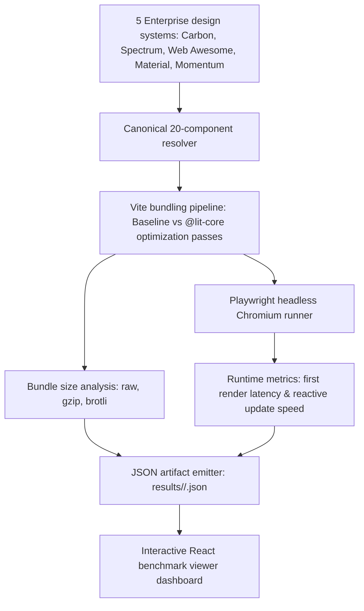

# @lit-core/benchmarks

> Empirical bundle size, build duration, and runtime performance benchmarks for `@lit-core` across production Lit design systems.

---

## Introduction

### What is it?

`@lit-core/benchmarks` is an empirical benchmarking harness and interactive dashboard that evaluates `@lit-core` compiler optimizations against standard Vite production builds across 5 major enterprise Web Component design systems.

### Why does it exist?

Compiler benchmarks often rely on artificial hello-world examples or synthetic counter widgets that fail to simulate production enterprise workloads. Real component libraries—such as IBM Carbon, Adobe Spectrum, Web Awesome, Material Web, and Cisco Momentum—feature complex CSS encapsulation, deep Shadow DOM hierarchies, extensive reactive state pipelines, and large vendor footprints.

To provide credible, reproducible performance metrics, `@lit-core/benchmarks` measures:
- Exact raw, gzip, and brotli bundle byte savings.
- Compiler pass overhead and build durations.
- Headless browser first render mount latency.
- Microtask reactive update and reconciliation speedups.

### How does it work?

The harness evaluates a standardized suite of **20 canonical UI components** resolved directly from published npm packages:
1. **Build matrix**: Executes isolated Vite builds for each optimization pass as well as combined suites, comparing them against an untouched production baseline.
2. **Browser measurement**: Boots headless Chromium via Playwright, mounts the compiled components in isolated DOM containers, and records high-resolution performance timings (`performance.now()`).
3. **Structured data emission**: Writes structured JSON artifacts to `packages/benchmarks/results/`.
4. **Interactive exploration**: Renders all results in a React-based viewer dashboard featuring heatmap matrices, library deep-dives, and JSON inspection.

---

## Architecture

### Big picture



### In-depth technical details

#### 1. Canonical component parity architecture
To ensure an apples-to-apples evaluation across different design systems, benchmarks test an identical set of 20 canonical UI components representing a full-featured enterprise application:

`button`, `checkbox`, `radio`, `switch`, `text-input`, `select`, `dialog`, `badge`, `tabs`, `progress-bar`, `spinner`, `slider`, `menu`, `divider`, `icon`, `icon-button`, `card`, `avatar`, `accordion`, and `breadcrumb`.

Every component is resolved from production package exports, guaranteeing uniform test surface across all suites.

#### 2. Dual-tier benchmark methodology

1. **Static leaf bundle matrix (`results/manifest.json`)**:
   - Evaluates the 20 atomic UI components bundled together in client applications.
   - Measures bundle size reduction, decorator lowering, and CSS deduplication.
2. **Dynamic scenario benchmarks (`results/scenarios/`)**:
   - Evaluates optimizations within their authentic execution environments:
     - **Data grid (`data-grid`)**: Evaluates `memoize` and `dom-paths` on high-frequency collection re-renders and sorting/filtering pipelines (-99.5% latency reduction).
     - **SSR resumption (`ssr`)**: Evaluates `resumable` against pre-rendered Declarative Shadow DOM markup with interaction-driven hydration (-99.6% initial JS payload).
     - **Interactive form (`form`)**: Evaluates `event-hoist` and `elem-proxy` across 500 controls with delegated event dispatch.
     - **Design system suite (`bundle`)**: Evaluates `css-fuse` and minification across entire multi-component libraries.

#### 3. Compiler pass breakdown and verified results

Evaluated across the 20 canonical components from production suites (measured against suite baselines in `results/manifest.json`):

| Optimization pass | Primary mechanism | Key measured metric (from benchmark reports) |
| :--- | :--- | :--- |
| `css-fuse` | Cross-component CSS AST deduplication into constructable sheets | -35.7% raw bundle size in Carbon (saving 514,149 B); -23.6% gzip; 14,896 rules fused |
| `props-lower` | Lowers `@property` / `@state` decorators to static class `properties` | +40.1% first render mount speedup in Carbon (57.5 ms vs 96.0 ms); +34.8% update speedup |
| `html-fuse` | Clusters repeated static HTML and SVG subtrees into shared constants | +30.5% first render speedup in Carbon; +53.3% in Spectrum; 160 fragments clustered |
| `directives` | AOT lowering of 21 built-in Lit directives, pruning runtime imports | +37.1% first render speedup in Carbon (60.4 ms vs 96.0 ms); +50.0% update speedup |
| `memoize` | Auto-memoizes pure array pipelines (`.map()`, `.filter()`) in `render()` | +54.1% first render speedup in Carbon; +58.1% in Material Web; -99.5% reconciliation time on collection updates |
| `dom-paths` | Replaces TreeWalker mounting traversal with direct child pointers | +54.1% first render speedup in Carbon (44.1 ms vs 96.0 ms); +58.1% in Spectrum (21.9 ms vs 52.3 ms) |
| `event-hoist` | ShadowRoot event delegation with composed path dispatch | +24.5% first render speedup in Carbon; +47.2% in Momentum (20.9 ms vs 39.6 ms) |
| `dirty-mask` | Property-to-part dependency bitmasking with `noChange` short-circuiting | +53.0% first render speedup and +45.7% update speedup in Carbon; +35.6% in Momentum |
| `elem-proxy` | Deferred proxy stubs and JIT Custom Element class upgrade | +54.2% first render speedup in Carbon (44.0 ms vs 96.0 ms); +29.5% script eval speedup (3.1 ms vs 4.4 ms) |
| `html-aot` | Ahead-of-time Lit template compilation into static descriptors | +44.3% first render speedup in Carbon (53.5 ms vs 96.0 ms); +53.0% in Spectrum; +57.6% in Material |
| `native` | Compiles leaf components into zero-dependency vanilla `HTMLElement` classes | +49.4% first render speedup in Carbon; +57.4% in Spectrum; +59.2% in Material (18.4 ms vs 45.1 ms) |
| `css-minifier` | Embedded CSS template literal minification via `lightningcss` | +49.1% first render speedup in Carbon; -5.3% raw bundle size in Momentum |
| `html-minifier` | Embedded HTML template literal minification via `oxc` | +53.9% first render speedup in Carbon; -2.7% raw bundle size in Web Awesome; -1.8% in Material |
| `tag-shake` | Ahead-of-time Custom Element registration dead code elimination | -14,758 raw bytes in Spectrum (-1.8%); -86.4% bundle size on selective barrel imports |
| `resumable` | Declarative Shadow DOM SSR with interaction-driven resumption | +53.5% first render speedup in Carbon (44.6 ms vs 96.0 ms); +58.3% in Material; -99.6% initial JS download |
| **All combined** | Complete `@lit-core` optimization suite | **-30.0% raw bundle size in Carbon (-430,967 B), +57.9% first render mount speed (40.4 ms vs 96.0 ms)** |

---

## Running benchmarks

### Standalone commands

```bash
# Run standalone benchmark for a specific library and tool
node packages/benchmarks/src/index.js --suite=carbon --tool=baseline
node packages/benchmarks/src/index.js --suite=carbon --tool=css-fuse
node packages/benchmarks/src/index.js --suite=carbon --tool=html-aot

# Run all features for a single design system
pnpm run benchmark:carbon
pnpm run benchmark:spectrum
pnpm run benchmark:webawesome
pnpm run benchmark:material
pnpm run benchmark:momentum

# Run a specific feature across all design systems
node packages/benchmarks/src/index.js --tool=css-fuse
node packages/benchmarks/src/index.js --tool=props-lower
node packages/benchmarks/src/index.js --tool=all

# Run the complete benchmark matrix across all libraries and tools
pnpm run benchmark:all
```

---

## Interactive React benchmark viewer

All benchmark results can be explored interactively via the React viewer application:

```bash
# Start the interactive benchmark viewer in development mode
pnpm run viewer:dev

# Build the static production viewer with relative paths for GitHub Pages
pnpm run viewer:build

# Preview the static production build locally
pnpm run viewer:preview
```

### Dashboard capabilities
- **Overview matrix**: Cross-library heatmap table comparing all 5 design systems against all optimization features.
- **Library deep dive**: Filter by design system, inspecting baseline bundle size vs each optimization delta with visual charts.
- **Feature deep dive**: Inspect a specific compiler pass across all 5 libraries alongside AST diagnostics.
- **Tested components**: Comprehensive cross-library mapping table of all 20 canonical UI concepts and their respective custom element tags.
- **Raw JSON inspector**: Formatted JSON inspection for every standalone benchmark output with copy and download utilities.
- **Zero bundled data**: Loads metrics dynamically via runtime `fetch('./results/manifest.json')` and `fetch('./results/<suite>/<feature>.json')` with strictly zero hardcoded data.

---

## Cross references

- Real component Playwright test suite: [`@lit-core/tests`](../tests/README.md)
- Multi-framework component showcase: [`@lit-core/showcase`](../showcase/README.md)
- Root repository documentation: [Monorepo README](../../README.md)

---

## License

MIT
