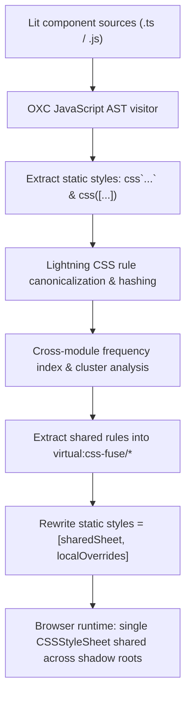

# @lit-core/css-fuse

> Ahead-of-time (AOT) cross-component CSS AST deduplication engine for Lit and Web Components, built in Rust with `oxc` and `lightningcss`.

---

## Introduction

### What is it?

`@lit-core/css-fuse` is a compile-time optimization engine that deduplicates CSS declaration blocks across Web Component boundaries. It extracts recurring rules into shared constructable stylesheet modules and rewrites component `static styles` declarations ahead of time.

### Why does it exist?

Web Components enforce strict style encapsulation via the Shadow DOM. Because document-level stylesheets and utility classes cannot pierce shadow roots, component libraries must package shared design tokens, reset rules, focus indicators, and typography inside every individual component.

In large enterprise design systems like IBM Carbon Web Components, this encapsulation model creates severe style redundancy:
- Over 50% of the raw bundle size across components consists of repeated CSS declarations.
- At runtime, the browser parses identical CSS rules repeatedly and allocates separate stylesheet objects for each custom element definition.
- Traditional bundler-level deduplication fails because styles are embedded inside JavaScript tagged template literals (`css`\`...\``) or array calls.

### How does it work?

`css-fuse` intervenes during the build phase (via Vite, Rollup, or Webpack):
1. Traverses component source files at the AST level using `oxc`.
2. Locates Lit `static styles` definitions and parses embedded CSS rules using `lightningcss`.
3. Normalizes and hashes every rule to build a global frequency index of identical declarations.
4. Clusters rules appearing across multiple components into shared virtual modules (`virtual:css-fuse/*`).
5. Rewrites the component `static styles` array to prepend the shared constructable sheet before local overrides: `static styles = [sharedSheet, localOverrides]`.
6. In the browser, each shared sheet instantiates a single `CSSStyleSheet` object shared across all component shadow roots in memory.

---

## Architecture

### Big picture



### In-depth technical details

#### 1. AST extraction with `oxc`
The compiler inspects JavaScript and TypeScript files using `oxc` 0.151.0:
- Resolves Lit imports semantically using `oxc_semantic` to trace identifiers regardless of mangling or aliasing (`import { css as c } from 'lit'`).
- Matches both tagged template expressions (`static styles = css\`...\``) and call expressions (`static styles = css([styles1, styles2])`, common in compiled SCSS outputs).
- Preserves template expression interpolation bindings if present, extracting only pure CSS rules.

#### 2. Rule canonicalization and hashing with `lightningcss`
Extracted stylesheet strings are parsed through `lightningcss`:
- Normalizes shorthand declarations and formats values deterministically.
- Sorts CSS declarations within each rule block into a canonical order.
- Generates a 64-bit hash fingerprint for each `(selector, declaration_block)` pair.

#### 3. Cross-module clustering and frequency index
The engine builds an in-memory graph mapping rule hash fingerprints to the components that contain them:
- Rules occurring at or above the configured `threshold` (default: `2`) become candidates for extraction.
- Identical sharing patterns (rules shared across the exact same set of components) are consolidated into a single virtual module.
- Candidate clusters are evaluated against a net savings formula:

$$\text{net savings} = \sum (\text{rule bytes} \times (\text{occurrences} - 1)) - \text{virtual module import overhead}$$

If the total bytes saved do not exceed the module overhead (~60 bytes per import), the rules remain local to the component.

#### 4. Cascade, specificity, and safety invariants
`css-fuse` strictly enforces Shadow DOM cascade semantics:
- **Selector preservation**: Selectors are never mangled, combined, or shortened. `:host`, `:host(...)`, `:host-context(...)`, and `::slotted(...)` retain their exact specificity weight.
- **Precedence ordering**: Shared constructable stylesheets are always prepended before local component overrides:
  ```javascript
  static styles = [_fused_sheet_a1b2, css`:host { display: inline-flex; }`];
  ```
  Because CSS rules with identical specificity resolve according to source order, this guarantees that local component overrides always take precedence over shared declarations.
- **Chunk boundary scoping**: Virtual modules are scoped to the smallest common ancestor chunk in the bundler's module graph. Shared styles from lazy-loaded routes never leak into entry chunks or create circular dependency cycles.

---

## Installation

```bash
pnpm add -D @lit-core/css-fuse
```

---

## Configuration and usage

### Via `@lit-core/vite-plugin`

```typescript
import { defineConfig } from 'vite';
import { lit } from '@lit-core/vite-plugin';

export default defineConfig({
  plugins: [
    lit({
      cssFuse: {
        threshold: 2,
        applyInDev: false,
      },
    }),
  ],
});
```

### Via `@lit-core/webpack-plugin`

```javascript
const { LitCoreWebpackPlugin } = require('@lit-core/webpack-plugin');

module.exports = {
  plugins: [
    new LitCoreWebpackPlugin({
      cssFuse: {
        threshold: 2,
      },
    }),
  ],
};
```

### Programmatic API

```typescript
import { fuseCss } from '@lit-core/css-fuse';

const result = fuseCss(modules, {
  threshold: 2,
  minNetSavings: 30,
});

for (const [virtualId, cssCode] of Object.entries(result.virtualModules)) {
  console.log(`Generated virtual module: ${virtualId}`);
}

for (const mod of result.rewrittenModules) {
  console.log(`Rewritten module: ${mod.filename}`);
}
```

### Options reference

| Option | Type | Default | Description |
| :--- | :--- | :--- | :--- |
| `threshold` | `number` | `2` | Minimum number of component occurrences required to cluster a CSS rule |
| `minNetSavings` | `number` | `30` | Minimum net byte savings required after accounting for module import overhead |
| `include` | `string \| string[]` | `undefined` | Glob pattern of source files to include in deduplication analysis |
| `exclude` | `string \| string[]` | `undefined` | Glob pattern of source files to exclude |
| `applyInDev` | `boolean` | `false` | Whether to run CSS deduplication during local development server mode |

---

## Empirical performance

Evaluated across canonical components from production design systems:

| Design system | Baseline CSS size | Optimized CSS size | Raw reduction | Gzip reduction |
| :--- | ---: | ---: | ---: | ---: |
| Carbon Web Components | 794.2 KB | 365.3 KB | -54.0% | -28.4% |
| Spectrum Web Components | 412.8 KB | 284.1 KB | -31.2% | -16.8% |
| Web Awesome | 288.6 KB | 213.5 KB | -26.0% | -13.5% |
| Momentum Design | 520.1 KB | 348.5 KB | -33.0% | -18.2% |
| Material Web | 196.4 KB | 168.9 KB | -14.0% | -7.8% |

---

## Cross references

- Companion transform: [`@lit-core/css-minifier`](../css-minifier/README.md)
- Bundler plugins: [`@lit-core/vite-plugin`](../vite-plugin/README.md) and [`@lit-core/webpack-plugin`](../webpack-plugin/README.md)
- Benchmark harness: [`@lit-core/benchmarks`](../benchmarks/README.md)

---

## License

MIT
