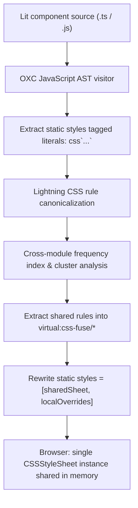

# CSS AST deduplication engine architecture

`@lit-core/css-fuse` is an ahead-of-time (AOT) deduplication engine designed specifically for Web Component styles inside Shadow DOM.

---

## The Shadow DOM encapsulation problem

In traditional multi-page or single-page web applications, developers frequently rely on utility-first CSS frameworks (like Tailwind CSS) or global atomic stylesheet resets. 

Inside Web Components, however, the Shadow DOM establishes strict style encapsulation:
- Global utility classes cannot penetrate shadow roots.
- Styles declared in document head have no impact on encapsulated elements.
- Component libraries (such as IBM Carbon or Adobe Spectrum) must either embed common resets, design tokens, focus styles, and typography rules in every component's `static styles` or inject link tags dynamically at runtime.

This duplication inflates bundle sizes dramatically—in IBM Carbon Web Components, over 50% of the entire package size consists of duplicate CSS declarations.

---

## AST-level deduplication mechanism

`@lit-core/css-fuse` avoids runtime stylesheet overhead by operating during the build pipeline:



### 1. AST extraction
The compiler uses `oxc` to traverse JavaScript and TypeScript files, locating Lit class declarations and extracting `static styles = css\`...\`` template literals.

### 2. Rule canonicalization
Extracted CSS strings are parsed using `lightningcss`. Shorthand properties are normalized, declarations are sorted deterministically, and a cryptographic 64-bit hash is computed for each `(selector, declaration)` pair.

### 3. Clustering and frequency index
Rules appearing across components equal to or greater than the configurable `threshold` (default: 2) are clustered into deterministic virtual stylesheet modules:
- Identical sharing patterns are grouped together into single shared constructable sheets.
- Sub-threshold or unique rules remain in component local stylesheets.

### 4. Cascade and specificity preservation
Shared rules are prepended before local rules:
```typescript
// Transformed component output
import { _fused_c7a1e2 } from 'virtual:css-fuse/c7a1e2';

export class CarbonButton extends LitElement {
  static styles = [_fused_c7a1e2, css`:host { display: inline-flex; }`];
}
```
This guarantees that local component overrides take precedence over shared declarations whenever selector specificity matches.

---

## Related documentation

- [Shadow DOM scoping audit guide](scoping-audit.md)
- [Vite plugin integration](../../vite-plugin/docs/configuration.md)
- [Benchmark metrics and empirical results](../../benchmarks/docs/metrics.md)
