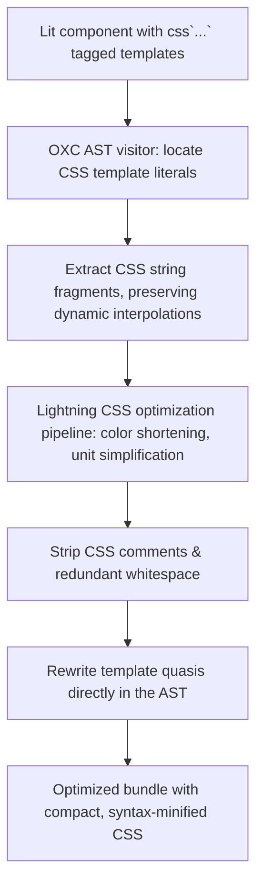

# @lit-core/css-minifier

> Native Rust embedded CSS template minifier for Lit and Web Components, powered by `lightningcss` and `oxc`.

---

## Introduction

### What is it?

`@lit-core/css-minifier` is a high-speed compile-time minifier that parses and compresses CSS embedded inside Lit `css` tagged template literals ahead of time using `lightningcss` and `oxc`.

### Why does it exist?

Lit components define styles directly inside JavaScript source files:
```typescript
static styles = css`
  :host {
    display: inline-block;
    color: #ffffff;
    padding: 0px 16px;
  }
`;
```
Standard JavaScript minifiers (such as Terser or esbuild) treat template string contents as opaque text:
- They cannot perform CSS-specific minifications like property sorting, unit simplification, or color shortening.
- Embedded CSS comments, indentation, and redundant whitespace are preserved in production bundles.
- Across large design systems, uncompressed CSS inside template literals adds 8% to 15% unnecessary bloat to production chunks.

### How does it work?

`css-minifier` integrates CSS-aware compression into the build pipeline:
1. Locates Lit `css` tagged template expressions during AST traversal with `oxc`.
2. Extracts CSS declaration strings and parses them with `lightningcss`.
3. Performs syntax-level CSS minification: strips comments, shortens colors, simplifies dimension units, and collapses whitespace.
4. Rewrites the template literal quasis directly in the AST, emitting fully minified CSS without runtime overhead.

---

## Architecture

### Big picture



### In-depth technical details

#### 1. Lightning CSS optimization passes
The minifier executes full CSS AST-level optimization:
- **Color shortening**: Converts verbose hex codes and named colors to their shortest equivalent (`#ffffff` to `#fff`, `rgba(0, 0, 0, 0)` to `transparent`).
- **Unit simplification**: Strips units from zero values (`0px` to `0`, `0rem` to `0`).
- **Whitespace compression**: Strips line breaks, indentation, and superfluous spaces around colons, braces, and semicolons.
- **Comment elimination**: Purges block and line comments.

#### 2. Interpolation safety
When templates include dynamic JavaScript expressions:
```typescript
css`:host { color: ${themeColor}; margin: 8px; }`
```
`css-minifier` minifies each static quasi independently while protecting dynamic expression boundary tokens, guaranteeing valid CSS syntax at runtime.

---

## Installation

```bash
pnpm add -D @lit-core/css-minifier
```

---

## Configuration and usage

### Via `@lit-core/vite-plugin`

```typescript
import { defineConfig } from 'vite';
import { LitCoreVitePlugin } from '@lit-core/vite-plugin';

export default defineConfig({
  plugins: [
    LitCoreVitePlugin({
      cssMinifier: true,
    }),
  ],
});

```

### Via `@lit-core/webpack-plugin`

```javascript
const { LitCoreWebpackPlugin } = require('@lit-core/webpack-plugin');

module.exports = {
  plugins: [
    new LitCoreWebpackPlugin({
      cssMinifier: true,
    }),
  ],
};
```

### Programmatic API

```typescript
import { minifyCssTemplate } from '@lit-core/css-minifier';

const minified = minifyCssTemplate(`
  :host {
    display: inline-flex;
    color: #ffffff;
    margin: 0px 4px;
  }
`);
console.log(minified);
// Output: :host{display:inline-flex;color:#fff;margin:0 4px}
```

---

## Empirical performance

Evaluated across canonical component suites (standalone `css-minifier` vs baseline in `packages/benchmarks/results/manifest.json`):

| Design system | Baseline bundle size | With `css-minifier` | Raw bundle reduction | Gzip reduction | First render speedup |
| :--- | ---: | ---: | ---: | ---: | ---: |
| Carbon Web Components | 1,438,781 B | 1,434,476 B | -0.3% (-4,305 B) | -0.04% (-66 B) | +49.1% (48.9 ms vs 96.0 ms) |
| Spectrum Web Components | 819,006 B | 818,661 B | -0.04% (-345 B) | -0.05% (-72 B) | +51.1% (25.6 ms vs 52.3 ms) |
| Web Awesome | 370,946 B | 337,367 B | -9.1% (-33,579 B) | -6.8% (-5,886 B) | +32.0% (27.9 ms vs 41.0 ms) |
| Momentum Design | 346,579 B | 328,340 B | -5.3% (-18,239 B) | -2.3% (-1,692 B) | +49.5% (20.0 ms vs 39.6 ms) |
| Material Web | 269,272 B | 269,272 B | 0.0% (0 B) | 0.0% (0 B) | +58.8% (18.6 ms vs 45.1 ms) |

> Embedded CSS template minification via `lightningcss` parses and optimizes inline CSS in `css\`...\`` tagged template strings, eliminating whitespace, redundant semicolons, and comments without disturbing JavaScript syntax.

---

## Cross references

- CSS deduplication: [`@lit-core/css-fuse`](../css-fuse/README.md)
- HTML template minification: [`@lit-core/html-minifier`](../html-minifier/README.md)
- Bundler plugins: [`@lit-core/vite-plugin`](../vite-plugin/README.md) and [`@lit-core/webpack-plugin`](../webpack-plugin/README.md)
- Benchmark harness: [`@lit-core/benchmarks`](../benchmarks/README.md)

---

## License

MIT
