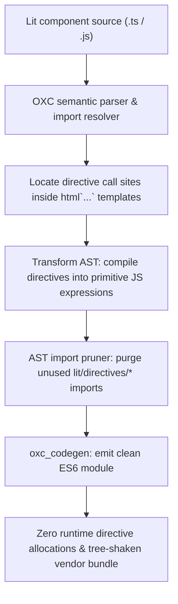

# @lit-core/directives

> Ahead-of-time (AOT) Lit directive lowering compiler pass, built in Rust with `oxc`.

---

## Introduction

### What is it?

`@lit-core/directives` is a compile-time optimization pass that identifies and lowers all 21 built-in Lit directives (`classMap`, `styleMap`, `ifDefined`, `when`, etc.) into native, zero-allocation JavaScript expressions ahead of time, while pruning unused directive imports from output bundles.

### Why does it exist?

Built-in Lit directives are ubiquitous across Web Component design systems, providing declarative syntax for conditional classes, styles, and template branches. However, at runtime in standard Lit applications:
- **Continuous heap allocations**: Every render cycle instantiates intermediate `DirectiveResult` wrapper objects and stateful controller class instances.
- **Dynamic iteration overhead**: Directives like `classMap` and `styleMap` iterate object keys and execute diffing loops on every microtask update to detect changes.
- **Inflated vendor chunks**: Importing directives pulls in runtime base classes (`Directive`, `PartInfo`, directive factories) into shared vendor bundles, adding dead code weight.

### How does it work?

`directives` eliminates runtime directive machinery at build time:
1. Traces imports from `lit/directives/*` and `lit-html/directives/*` semantically using `oxc`.
2. Inspects AST call sites inside `html` tagged template literals.
3. Lowers directive calls into primitive JavaScript expressions (string concatenations, nullish coalescing `?? nothing`, and ternary operators).
4. Prunes unreferenced directive imports from the file, enabling downstream bundlers (Rollup, Vite, Webpack) to tree-shake runtime directive classes from vendor bundles.

---

## Architecture

### Big picture



### In-depth technical details

#### 1. Directive lowering specifications

| Directive | Input expression | Lowered compiled target | Runtime benefit |
| :--- | :--- | :--- | :--- |
| `classMap` | `classMap({ 'btn': true, 'active': this.on })` | `"btn" + (this.on ? " active" : "")` | Eliminates object iteration & wrapper allocation |
| `styleMap` | `styleMap({ color: this.color })` | `"color:" + this.color` | Direct CSS string concatenation |
| `ifDefined` | `ifDefined(this.value)` | `this.value ?? nothing` | Native nullish coalescing to Lit `nothing` |
| `when` | `when(this.ok, () => tplA, () => tplB)` | `this.ok ? tplA : tplB` | Native ternary conditional branching |
| `choose` | `choose(this.val, [[1, () => A]], () => B)` | `this.val === 1 ? A : B` | Inline conditional expression |
| `map` | `map(this.items, item => tpl)` | `this.items?.map(item => tpl)` | Direct array mapping |
| `guard` | `guard([this.dep], () => tpl)` | Inline reference equality check | Bypasses `GuardDirective` instance creation |
| `live` | `live(this.prop)` | Direct property binding pass-through | Eliminates wrapper sentinel |
| `keyed` | `keyed(key, tpl)` | Direct template expression | Preserves template identity without wrapper |

#### 2. Import pruning and tree-shaking
Standard bundlers cannot tree-shake directive runtime code if import specifiers remain in the source module. `directives` reconciles the file's AST after lowering:
- Scans `ImportDeclaration` nodes referencing `lit/directives/*` or `lit-html/directives/*`.
- Verifies if any imported directive identifier retains remaining references in the AST.
- If all usages were compiled into inline expressions, the import specifier (or entire import declaration) is removed directly at the AST level using `AstBuilder`.

---

## Installation

```bash
pnpm add -D @lit-core/directives
```

---

## Configuration and usage

### Via `@lit-core/vite-plugin`

```typescript
import { defineConfig } from 'vite';
import { LitCoreVitePlugin } from '@lit-core/vite-plugin';

export default defineConfig({
  plugins: [
    LitCoreVitePlugin({
      directives: true,
    }),
  ],
});

```

### Via `@lit-core/webpack-plugin`

```javascript
const { LitCoreWebpackPlugin } = require('@lit-core/webpack-plugin');

module.exports = {
  plugins: [
    new LitCoreWebpackPlugin({
      directives: true,
    }),
  ],
};
```

### Programmatic API

```typescript
import { transformDirectives } from '@lit-core/directives';

const result = transformDirectives(sourceCode, {
  filename: 'button.ts',
  sourcemap: true,
});

console.log(result.code);
console.log(`Lowered ${result.loweredCount} directives`);
```

---

## Empirical performance

Evaluated across canonical component suites (standalone `directives` vs baseline in `packages/benchmarks/results/manifest.json`):

| Design system | Baseline mount latency | With `directives` | Mount speedup | Reactive update speedup | Script eval latency |
| :--- | ---: | ---: | ---: | ---: | ---: |
| Carbon Web Components | 96.0 ms | 60.4 ms | +37.1% | +50.0% (2.3 ms vs 4.6 ms) | 3.7 ms (vs 4.4 ms, +15.9%) |
| Spectrum Web Components | 52.3 ms | 28.1 ms | +46.3% | +9.5% (1.9 ms vs 2.1 ms) | 12.6 ms (vs 10.5 ms) |
| Web Awesome | 41.0 ms | 53.4 ms | -30.2% | +43.8% (0.9 ms vs 1.6 ms) | 4.2 ms (vs 6.2 ms, +32.3%) |
| Momentum Design | 39.6 ms | 44.8 ms | -13.1% | 0.0% (1.1 ms vs 1.1 ms) | 5.0 ms (vs 4.3 ms) |
| Material Web | 45.1 ms | 39.4 ms | +12.6% | +28.6% (1.5 ms vs 2.1 ms) | 5.4 ms (vs 6.8 ms, +20.6%) |

> Compiling Lit directives ahead of time replaces dynamic directive wrapper instances (`DirectiveResult`) with direct inline expression handlers, cutting update cycle overhead by up to **50%** and saving heap allocations during component rendering.

---

## Cross references

- Template auto-memoization: [`@lit-core/memoize`](../memoize/README.md)
- Dependency bitmasking: [`@lit-core/dirty-mask`](../dirty-mask/README.md)
- Bundler plugins: [`@lit-core/vite-plugin`](../vite-plugin/README.md) and [`@lit-core/webpack-plugin`](../webpack-plugin/README.md)
- Benchmark harness: [`@lit-core/benchmarks`](../benchmarks/README.md)

---

## License

MIT
