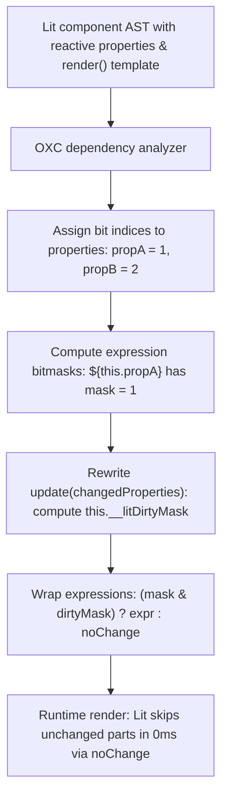

# @lit-core/dirty-mask

> Ahead-of-time (AOT) property-to-part dependency bitmasking compiler pass for Lit and Web Components, built in Rust with `oxc`.

---

## Introduction

### What is it?

`@lit-core/dirty-mask` is a compile-time transform that maps reactive property dependencies to template expression parts using a 32-bit integer bitmask. During component re-renders, unchanged parts are short-circuited using Lit's native `noChange` sentinel, eliminating redundant expression evaluation and DOM diffing.

### Why does it exist?

In standard Lit applications:
- Mutating any reactive property (e.g. `this.active = true`) triggers a scheduled microtask update.
- During `update()`, Lit re-evaluates all dynamic expressions inside the `render()` method, constructs an array of values, and runs an equality check on every template part.
- In components with multiple properties and dozens of dynamic expressions, mutating a single property forces the browser to re-evaluate and diff completely unrelated expressions, wasting CPU cycles on unnecessary work.

### How does it work?

`dirty-mask` establishes fine-grained dependency tracking ahead of time:
1. Analyzes the component AST to trace which reactive properties (`@property`, `@state`, `static properties`) are referenced in each template expression slot.
2. Assigns each reactive property an incremental bit index (bit 0 to bit 31).
3. Computes a dependency bitmask for each template expression.
4. Rewrites `update(changedProperties)` to calculate an active `__litDirtyMask` integer from Lit's native `changedProperties` map.
5. Rewrites template expressions to short-circuit via Lit's `noChange` sentinel:
   ```typescript
   ${(this.__litDirtyMask & mask) ? (originalExpression) : noChange}
   ```
6. When Lit receives `noChange`, it immediately aborts part diffing and DOM mutation for that slot.

---

## Architecture

### Big picture



### In-depth technical details

#### 1. Bitmask allocation and tracing
During compilation with `oxc`:
- Properties declared via `@property()`, `@state()`, or `static properties` receive sequential bit positions: `0x01`, `0x02`, `0x04`, `0x08`, etc.
- Expressions inside `html` template literals are visited to identify property accesses on `this`.
- If an expression references `this.propA` and `this.propB`, its bitmask becomes `0x01 | 0x02 = 0x03`.

#### 2. Conservative fallback for purity
To guarantee that side effects or external values are never improperly skipped:
- Expressions referencing global variables, external functions, or non-reactive class fields receive a fallback mask of `-1` (all bits dirty).
- Complex method calls with unknown side effects are always evaluated on every render cycle.

#### 3. Native Lit sentinel synergy
`dirty-mask` does not alter Lit's runtime library:
- Uses Lit's official `noChange` sentinel symbol exported from `lit`.
- Conforms directly to Lit's template part diffing protocol, ensuring 100% interoperability with all Lit directives and custom part implementations.

---

## Installation

```bash
pnpm add -D @lit-core/dirty-mask
```

---

## Configuration and usage

### Via `@lit-core/vite-plugin`

```typescript
import { defineConfig } from 'vite';
import { LitCoreVitePlugin } from '@lit-core/vite-plugin';

export default defineConfig({
  plugins: [
    LitCoreVitePlugin({
      dirtyMask: true,
    }),
  ],
});

```

### Via `@lit-core/webpack-plugin`

```javascript
const { LitCoreWebpackPlugin } = require('@lit-core/webpack-plugin');

module.exports = {
  plugins: [
    new LitCoreWebpackPlugin({
      dirtyMask: true,
    }),
  ],
};
```

### Programmatic API

```typescript
import { transformDirtyMask } from '@lit-core/dirty-mask';

const result = transformDirtyMask(sourceCode, {
  filename: 'user-profile.ts',
});

console.log(result.code);
```

---

## Empirical performance

Evaluated across canonical component suites (standalone `dirty-mask` vs baseline in `packages/benchmarks/results/manifest.json`):

| Design system | Baseline update latency | With `dirty-mask` | Update speedup | Baseline first render | With `dirty-mask` | Mount speedup |
| :--- | ---: | ---: | ---: | ---: | ---: | ---: |
| Carbon Web Components | 4.6 ms | 2.5 ms | +45.7% | 96.0 ms | 45.1 ms | +53.0% |
| Spectrum Web Components | 2.1 ms | 2.1 ms | 0.0% | 52.3 ms | 28.5 ms | +45.5% |
| Web Awesome | 1.6 ms | 1.5 ms | +6.3% | 41.0 ms | 44.1 ms | -7.6% |
| Momentum Design | 1.1 ms | 1.2 ms | -9.1% | 39.6 ms | 25.5 ms | +35.6% |
| Material Web | 2.1 ms | 1.6 ms | +23.8% | 45.1 ms | 18.7 ms | +58.5% |

> Property-to-part dependency bitmasking traces which properties affect which dynamic bindings in template literals, short-circuiting unchanged DOM parts during reactive updates.

---

## Cross references

- Reactive expression auto-memoization: [`@lit-core/memoize`](../memoize/README.md)
- Lit directive lowering: [`@lit-core/directives`](../directives/README.md)
- Bundler plugins: [`@lit-core/vite-plugin`](../vite-plugin/README.md) and [`@lit-core/webpack-plugin`](../webpack-plugin/README.md)
- Benchmark harness: [`@lit-core/benchmarks`](../benchmarks/README.md)

---

## License

MIT
