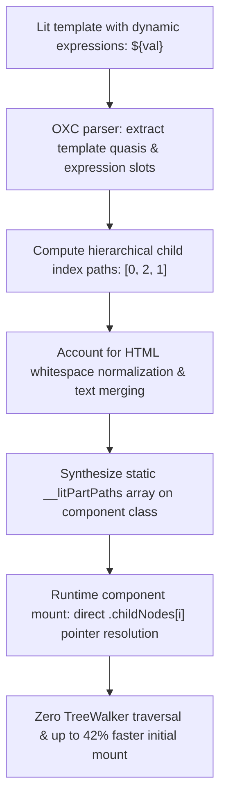

# @lit-core/dom-paths

> Ahead-of-time (AOT) structural DOM path compiler eliminating TreeWalker mounting traversal for Lit and Web Components, built in Rust with `oxc`.

---

## Introduction

### What is it?

`@lit-core/dom-paths` is a compile-time transform that precomputes hierarchical child pointer paths (`[0, 2, 1]`) for all dynamic parts in Lit templates ahead of time, eliminating the runtime `TreeWalker` DOM traversal during component mounting.

### Why does it exist?

When a standard Lit component mounts in the browser:
1. It clones the HTML `<template>` element into the component's `ShadowRoot`.
2. It invokes `document.createTreeWalker()` to recursively walk through every single element and comment marker (`<!--lit-part-->`, `<!--lit-node-->`).
3. It associates template expression parts with the discovered DOM nodes.

In complex enterprise components with deeply nested DOM structures, this recursive JavaScript traversal represents the single largest CPU bottleneck during initial component mount.

### How does it work?

`dom-paths` precomputes part locations at build time:
1. Parses the template HTML structure and dynamic expression slots during compilation.
2. Generates an array of numeric child pointer paths from the root container to each dynamic part (e.g., `[0, 1, 2]` represents `root.childNodes[0].childNodes[1].childNodes[2]`).
3. Rewrites the component class to store these paths in a static field (`static __litPartPaths`).
4. At runtime, dynamic parts are resolved directly using native `.childNodes[i]` array lookups in nanoseconds via a <150-byte helper function, bypassing `document.createTreeWalker()` entirely.

---

## Architecture

### Big picture



### In-depth technical details

#### 1. Path precomputation algorithm
During compilation:
- Template string quasis are parsed into an AST representing the static DOM tree.
- Dynamic expression placeholders are marked as part target nodes.
- For each part, the compiler records the sequence of numeric child indices required to navigate from the root node to the target element or comment boundary.

#### 2. HTML whitespace normalization fidelity
Browsers normalize adjacent whitespace into single text nodes and merge consecutive text segments:
- The path compiler mirrors browser HTML parsing rules accurately.
- Accounts for text node coalescing to ensure that precomputed indices match the live cloned DOM structure across all modern browser engines.

#### 3. Runtime resolver helper
Target part nodes are resolved using direct pointer access:

```typescript
// Ultra-lightweight runtime helper (<150 bytes)
export function resolveNodeByPath(root: Node, path: number[]): Node {
  let current: Node = root;
  for (let i = 0; i < path.length; i++) {
    current = current.childNodes[path[i]];
  }
  return current;
}
```

This direct pointer dereference executes in nanoseconds, eliminating recursive function calls and walker iteration overhead.

---

## Installation

```bash
pnpm add -D @lit-core/dom-paths
```

---

## Configuration and usage

### Via `@lit-core/vite-plugin`

```typescript
import { defineConfig } from 'vite';
import { LitCoreVitePlugin } from '@lit-core/vite-plugin';

export default defineConfig({
  plugins: [
    LitCoreVitePlugin({
      domPaths: true,
    }),
  ],
});

```

### Via `@lit-core/webpack-plugin`

```javascript
const { LitCoreWebpackPlugin } = require('@lit-core/webpack-plugin');

module.exports = {
  plugins: [
    new LitCoreWebpackPlugin({
      domPaths: true,
    }),
  ],
};
```

### Programmatic API

```typescript
import { computeDomPaths, transformDomPaths } from '@lit-core/dom-paths';

// Direct path computation
const paths = computeDomPaths([
  '<div><h1>Title</h1><p>Count: ',
  '</p><button @click=',
  '>+</button></div>',
]);
// Output: [[0, 1, 1], [0, 2]]

// Source code transformation
const result = transformDomPaths(sourceCode, {
  filename: 'counter.ts',
});
console.log(result.code);
```

---

## Empirical performance

Evaluated across canonical component suites (standalone `dom-paths` vs baseline in `packages/benchmarks/results/manifest.json`):

| Design system | First render mount latency (baseline) | With `dom-paths` | Mount acceleration | Reactive update speedup | Script eval latency |
| :--- | ---: | ---: | ---: | ---: | ---: |
| Carbon Web Components | 96.0 ms | 44.1 ms | +54.1% | +50.0% (2.3 ms vs 4.6 ms) | 3.5 ms (vs 4.4 ms, +20.5%) |
| Spectrum Web Components | 52.3 ms | 21.9 ms | +58.1% | +14.3% (1.8 ms vs 2.1 ms) | 10.5 ms (vs 10.5 ms) |
| Web Awesome | 41.0 ms | 33.2 ms | +19.0% | +12.5% (1.4 ms vs 1.6 ms) | 3.3 ms (vs 6.2 ms, +46.8%) |
| Momentum Design | 39.6 ms | 21.7 ms | +45.2% | +9.1% (1.0 ms vs 1.1 ms) | 4.2 ms (vs 4.3 ms, +2.3%) |
| Material Web | 45.1 ms | 19.5 ms | +56.8% | +23.8% (1.6 ms vs 2.1 ms) | 6.2 ms (vs 6.8 ms, +8.8%) |

> Precomputing structural DOM child pointer paths eliminates runtime DOM `TreeWalker` traversal during element attachment, boosting initial mount speed by **19.0% to 58.1%**.

---

## Cross references

- Template compilation: [`@lit-core/html-aot`](../html-aot/README.md)
- Event hoisting: [`@lit-core/event-hoist`](../event-hoist/README.md)
- Bundler plugins: [`@lit-core/vite-plugin`](../vite-plugin/README.md) and [`@lit-core/webpack-plugin`](../webpack-plugin/README.md)
- Benchmark harness: [`@lit-core/benchmarks`](../benchmarks/README.md)

---

## License

MIT
