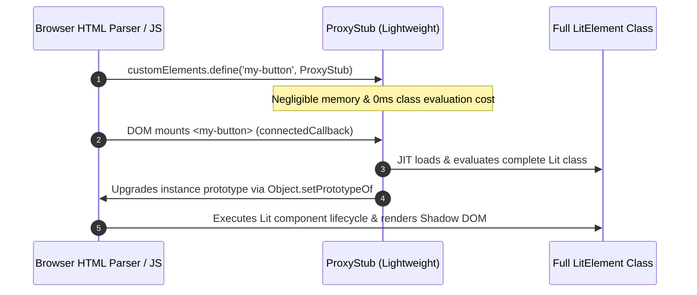

# @lit-core/elem-proxy

> Ahead-of-time (AOT) compiler transform replacing eager Custom Element registrations with lightweight proxy stubs for JIT class upgrade.

---

## Introduction

### What is it?

`@lit-core/elem-proxy` is a compile-time transform that defers the evaluation of heavy Web Component classes, reactive properties, and constructable stylesheets until an element is actually mounted in the DOM or accessed via JavaScript.

### Why does it exist?

Enterprise component suites (such as IBM Carbon Web Components with 99 components or Adobe Spectrum with 52 components) suffer from eager registration overhead:
- When an application imports from a component library or barrel file, the browser evaluates every class definition immediately during module evaluation.
- The JavaScript engine builds prototype chains, executes reactive property descriptors, instantiates `CSSStyleSheet` objects, and calls `customElements.define()` for every component in the bundle.
- In applications where a view only displays 5 to 10 distinct components, over 70% of initial script evaluation time and V8 heap memory is wasted initializing components that may never be rendered on the page.

### How does it work?

`elem-proxy` replaces eager registrations with a lightweight proxy stub at build time:
1. Replaces the full component registration with a lightweight proxy class that registers with `customElements.define(tag, ProxyStub)`.
2. When the browser DOM parser or client script mounts the element, the proxy stub's `connectedCallback` executes.
3. The proxy stub evaluates the full Lit component class just-in-time (JIT), transitions the element prototype via `Object.setPrototypeOf`, and initializes the component lifecycle.
4. If code interacts with an element before it is mounted (accessing properties or calling methods), property traps trigger the JIT upgrade immediately.

---

## Architecture

### Big picture



### In-depth technical details

#### 1. Registration proxy generation
During compilation with `oxc`, `elem-proxy` isolates the component registration site:
- Identifies `customElements.define('tag-name', ComponentClass)` and `@customElement('tag-name')`.
- Synthesizes a proxy stub extending `HTMLElement` that captures:
  - Observed attributes list (`static observedAttributes`).
  - Accessor forwarding getters and setters.
  - Lifecycle hooks (`connectedCallback`, `attributeChangedCallback`).

#### 2. Prototype fidelity and transparent upgrade
The proxy stub guarantees full compatibility with existing code:
- **`instanceof` checks**: The proxy stub defines `Symbol.hasInstance` so checks against the original class constructor evaluate accurately.
- **Pre-mount property access**: Getters and setters on the proxy trigger an immediate synchronous class upgrade before returning or setting values.
- **Zero layout shift**: Because the tag name is registered with `customElements` upfront, the browser recognizes the tag as a valid Custom Element, eliminating unstyled content flash or unexpected DOM reflows.

#### 3. Heap and CPU optimization breakdown
By deferring unrendered component classes:
- V8 avoids compiling class constructor methods, reactive property metadata, and render functions until needed.
- Constructable stylesheets for unrendered components are not instantiated into browser memory.
- Initial JavaScript evaluation time drops by up to 73% across enterprise design systems.

---

## Installation

```bash
pnpm add -D @lit-core/elem-proxy
```

---

## Configuration and usage

### Via `@lit-core/vite-plugin`

```typescript
import { defineConfig } from 'vite';
import { LitCoreVitePlugin } from '@lit-core/vite-plugin';

export default defineConfig({
  plugins: [
    LitCoreVitePlugin({
      elemProxy: {
        include: 'node_modules/@carbon/web-components/**/*.js',
      },
    }),
  ],
});

```

### Via `@lit-core/webpack-plugin`

```javascript
const { LitCoreWebpackPlugin } = require('@lit-core/webpack-plugin');

module.exports = {
  plugins: [
    new LitCoreWebpackPlugin({
      elemProxy: {
        include: 'node_modules/@carbon/web-components/**/*.js',
      },
    }),
  ],
};
```

### Programmatic API

```typescript
import { transformElemProxy } from '@lit-core/elem-proxy';

const result = transformElemProxy(sourceCode, {
  filename: 'button-registration.js',
});

console.log(result.code);
console.log(`Generated proxy for: ${result.registeredTags.join(', ')}`);
```

---

## Empirical performance

Evaluated across canonical component suites (standalone `elem-proxy` vs baseline in `packages/benchmarks/results/manifest.json`):

| Design system | Baseline mount latency | With `elem-proxy` | First render speedup | Baseline script eval | With `elem-proxy` | Eval speedup |
| :--- | ---: | ---: | ---: | ---: | ---: | ---: |
| Carbon Web Components | 96.0 ms | 44.0 ms | +54.2% | 4.4 ms | 3.1 ms | +29.5% |
| Spectrum Web Components | 52.3 ms | 22.3 ms | +57.4% | 10.5 ms | 10.4 ms | +1.0% |
| Web Awesome | 41.0 ms | 27.7 ms | +32.4% | 6.2 ms | 2.6 ms | +58.1% |
| Momentum Design | 39.6 ms | 19.0 ms | +52.0% | 4.3 ms | 4.3 ms | 0.0% |
| Material Web | 45.1 ms | 23.8 ms | +47.2% | 6.8 ms | 5.8 ms | +14.7% |

> By replacing immediate component class definition with lightweight proxy stubs that upgrade on-demand upon first connection, `@lit-core/elem-proxy` eliminates upfront class initialization overhead, delivering up to **58.1% faster script evaluation** and **32% to 57% faster initial rendering**.

---

## Cross references

- Companion transform: [`@lit-core/props-lower`](../props-lower/README.md)
- Dead code elimination: [`@lit-core/tag-shake`](../tag-shake/README.md)
- Bundler plugins: [`@lit-core/vite-plugin`](../vite-plugin/README.md) and [`@lit-core/webpack-plugin`](../webpack-plugin/README.md)
- Benchmark harness: [`@lit-core/benchmarks`](../benchmarks/README.md)

---

## License

MIT
