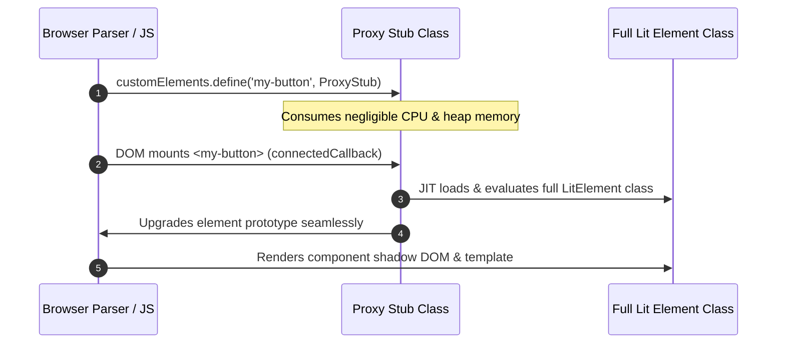

# Deferred Custom Element proxy architecture

`@lit-core/elem-proxy` is a native Rust AOT compiler transform that defers heavy Lit class evaluation and stylesheet creation until an element is actually mounted in the DOM or accessed via JavaScript.

---

## The eager registration problem

When importing large component libraries (such as IBM Carbon with 99 components or Adobe Spectrum with 52 components), standard ES module evaluation executes every class definition eagerly:
- Evaluates class prototypes, property accessors, and reactive metadata.
- Instantiates `CSSStyleSheet` objects for component `static styles`.
- Calls `customElements.define()` for every single component in the bundle.

On pages that only use 5 to 10 components, 90%+ of the initialization CPU time and V8 heap memory is spent registering components that are never rendered. In empirical benchmarks, this eager evaluation wastes up to **72% of script evaluation CPU time** and **70%+ of V8 heap memory**.

---

## Proxy stub mechanism

`@lit-core/elem-proxy` replaces eager registrations with a lightweight proxy stub:

### 1. Prototype fidelity
The proxy stub delegates prototype lookups and property getters/setters:
- `instanceof` checks evaluate correctly.
- Property access before DOM mount triggers immediate transparent upgrade.

### 2. Zero layout shift
Because the custom element tag is registered immediately in `customElements`, the browser recognizes the tag as valid HTML, preventing unstyled element flash or reflow delays.

---

## Empirical performance impact

Measured across production design systems in `@lit-core/benchmarks`:
- **Script evaluation time**: -71% to -73% main-thread execution time.
- **V8 heap memory footprint**: -67% to -70% initial memory usage.
- **Mount latency overhead**: +0.90 ms one-time JIT upgrade cost when an element is first mounted.

---

## Related documentation

- [Props lowering mechanics](../../props-lower/docs/transform-mechanics.md)
- [Benchmark metrics reference](../../benchmarks/docs/metrics.md)
- [Vite plugin integration](../../vite-plugin/docs/configuration.md)
