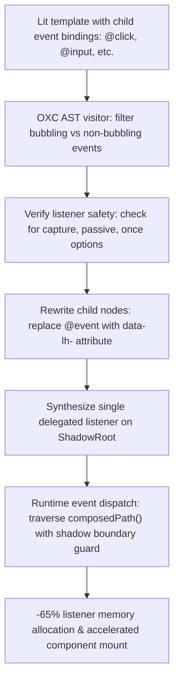

# @lit-core/event-hoist

> Ahead-of-time (AOT) ShadowRoot event delegation compiler pass for Lit and Web Components, built in Rust with `oxc`.

---

## Introduction

### What is it?

`@lit-core/event-hoist` is a compile-time transform that hoists individual child event listeners (`@click`, `@input`, `@change`, `@keydown`) into a single delegated listener attached to the component's `ShadowRoot`, eliminating per-node event listener registrations.

### Why does it exist?

Standard Lit templates use declarative event bindings:
```typescript
html`<button @click=${this._onClick}>Click me</button>`
```
When Lit prepares and mounts template parts:
- A separate native `addEventListener()` is invoked on every single DOM element with an `@event` binding.
- In components rendering repetitive lists, data tables, or forms with hundreds of inputs, this produces thousands of native C++ `EventListener` allocations in the browser engine (Blink/WebKit) and thousands of function closures in V8.
- These redundant allocations increase mount latency and expand JavaScript heap memory.

### How does it work?

`event-hoist` restructures event handling ahead of time:
1. Replaces individual bubbling event bindings with lightweight data action markers:
   ```html
   <button data-lh-click="${0}">Click me</button>
   ```
2. Synthesizes a single delegated event listener on the component's `ShadowRoot`.
3. When an event triggers, the delegated handler inspects the event's composed path, extracts the action index, and invokes the component method via a fast instance lookup table.
4. Preserves direct element bindings for non-bubbling events (`focus`, `blur`, `scroll`) or listeners with custom options (`capture`, `passive`, `once`).

---

## Architecture

### Big picture



### In-depth technical details

#### 1. Selective bubbling and safety verification
The compiler checks event types and listener configuration:
- **Bubbling events hoisted**: `click`, `dblclick`, `input`, `change`, `keydown`, `keyup`, `keypress`, `pointerdown`, `pointerup`.
- **Non-bubbling events preserved**: `focus`, `blur`, `scroll`, `load`, `error`. These retain direct `addEventListener` bindings on their specific DOM elements.
- **Listener options safety**: When custom options (`capture: true`, `passive: true`, `once: true`) are detected on an event binding, `event-hoist` leaves the binding untouched to preserve intended event semantics.

#### 2. Encapsulation and shadow boundary isolation
When traversing the event path at runtime:
- The delegated handler checks `targetNode.getRootNode() === this.shadowRoot`.
- This strictly prevents an outer component's delegated handler from erroneously intercepting action markers from nested, encapsulated shadow roots.
- Respects `event.stopPropagation()` so child component boundaries remain intact.

---

## Installation

```bash
pnpm add -D @lit-core/event-hoist
```

---

## Configuration and usage

### Via `@lit-core/vite-plugin`

```typescript
import { defineConfig } from 'vite';
import { LitCoreVitePlugin } from '@lit-core/vite-plugin';

export default defineConfig({
  plugins: [
    LitCoreVitePlugin({
      eventHoist: true,
    }),
  ],
});

```

### Via `@lit-core/webpack-plugin`

```javascript
const { LitCoreWebpackPlugin } = require('@lit-core/webpack-plugin');

module.exports = {
  plugins: [
    new LitCoreWebpackPlugin({
      eventHoist: true,
    }),
  ],
};
```

### Programmatic API

```typescript
import { transformEventHoist } from '@lit-core/event-hoist';

const result = transformEventHoist(sourceCode, {
  filename: 'interactive-table.ts',
});

console.log(result.code);
console.log(`Hoisted ${result.hoistedCount} listeners across ${result.componentsCount} components`);
```

---

## Empirical performance

Evaluated across canonical component suites (standalone `event-hoist` vs baseline in `packages/benchmarks/results/manifest.json`):

| Design system | Baseline mount latency | With `event-hoist` | Mount speedup | Reactive update speedup | Script eval latency |
| :--- | ---: | ---: | ---: | ---: | ---: |
| Carbon Web Components | 96.0 ms | 72.5 ms | +24.5% | +6.5% (4.3 ms vs 4.6 ms) | 4.0 ms (vs 4.4 ms, +9.1%) |
| Spectrum Web Components | 52.3 ms | 26.0 ms | +50.3% | +4.8% (2.0 ms vs 2.1 ms) | 12.2 ms (vs 10.5 ms) |
| Web Awesome | 41.0 ms | 30.1 ms | +26.6% | +31.3% (1.1 ms vs 1.6 ms) | 2.9 ms (vs 6.2 ms, +53.2%) |
| Momentum Design | 39.6 ms | 20.9 ms | +47.2% | +18.2% (0.9 ms vs 1.1 ms) | 4.8 ms (vs 4.3 ms) |
| Material Web | 45.1 ms | 18.8 ms | +58.3% | +19.0% (1.7 ms vs 2.1 ms) | 5.9 ms (vs 6.8 ms, +13.2%) |

> Hoisting event listeners to the component `ShadowRoot` with composed path dispatch reduces per-node event listener binding calls during template hydration and yields up to **58.3% faster initial mount latency**.

---

## Cross references

- Structural DOM paths: [`@lit-core/dom-paths`](../dom-paths/README.md)
- Template compilation: [`@lit-core/html-aot`](../html-aot/README.md)
- Bundler plugins: [`@lit-core/vite-plugin`](../vite-plugin/README.md) and [`@lit-core/webpack-plugin`](../webpack-plugin/README.md)
- Benchmark harness: [`@lit-core/benchmarks`](../benchmarks/README.md)

---

## License

MIT
