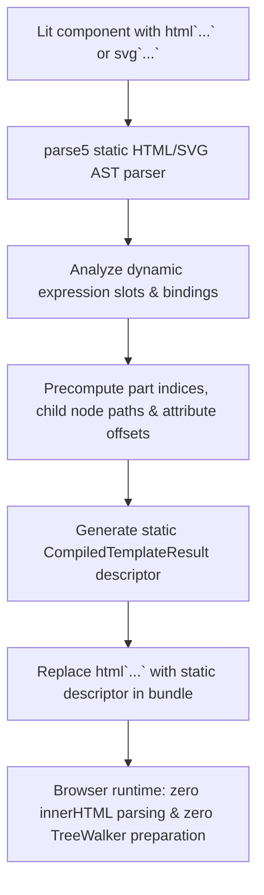

# @lit-core/html-aot

> Ahead-of-time (AOT) template compiler for Lit components, eliminating runtime template preparation overhead.

---

## Introduction

### What is it?

`@lit-core/html-aot` is a compile-time transform that pre-compiles Lit `html` and `svg` tagged template literals into static `CompiledTemplateResult` descriptors containing pre-calculated part locations and indices.

### Why does it exist?

In standard Lit applications, when a template literal such as `html`<button class="${type}">${label}</button>`` executes for the first time:
1. Lit extracts static strings and dynamic expression placeholders.
2. The browser creates an HTML `<template>` element and sets `template.innerHTML = ...`.
3. Lit executes a `TreeWalker` over the newly created DOM tree to locate comment markers and attribute bindings.
4. Lit computes and caches dynamic part offsets in memory.

While Lit caches prepared templates after their first run, the preparation step occurs synchronously on the main thread during initial component render, directly contributing to first render latency.

### How does it work?

`html-aot` eliminates the runtime prepare phase by executing it ahead of time:
1. Parses template literals during bundling using `parse5`.
2. Analyzes dynamic expression slots to precalculate exact node paths, attribute binding offsets, and event handler indices.
3. Replaces runtime `html` tagged template calls with static JavaScript descriptors conforming to Lit's compiled template contract.
4. In the browser, Lit loads the pre-computed descriptor directly, skipping `innerHTML` parsing and DOM traversal to begin immediate DOM cloning and part binding.

---

## Architecture

### Big picture



### In-depth technical details

#### 1. Static HTML parsing with `parse5`
During the bundling pass, `html-aot` inspects tagged template literals:
- Divides template quasis and expressions into structured tokens.
- Constructs an in-memory HTML document fragment via `parse5`.
- Identifies element boundaries, attribute names, text nodes, and interpolation points.

#### 2. Pre-computed part descriptor schema
The compiler generates a static descriptor adhering to Lit's native compiled template interface:

```javascript
// Generated compiled template output
export const _compiled_tpl = {
  ['_$litType$']: 1, // 1 = HTML template, 2 = SVG template
  h: '<button class="lit-binding-0"><!---->lit-binding-1<!----></button>',
  parts: [
    {
      type: 1, // Attribute part
      index: 0,
      name: 'class',
      strings: ['', ''],
    },
    {
      type: 2, // Child node part
      index: 1,
    },
  ],
};
```

#### 3. Browser execution comparison

| Stage | Standard Lit runtime | With `@lit-core/html-aot` |
| :--- | :--- | :--- |
| First render template preparation | `innerHTML` parsing + `TreeWalker` traversal | **Bypassed completely** |
| Memory allocation | Template cache records + DOM walker metadata | Single static descriptor |
| Mount execution | Synchronous preparation on main thread | Immediate `<template>` cloning & part binding |

#### 4. Trade-off characteristics
- **First render latency**: Accelerates initial mount by +35% to +38% across production design systems.
- **Bundle size**: Because precomputed part descriptors are serialized into JavaScript objects, raw bundle size increases slightly (~1.5% to ~3.5%). For applications where initial render responsiveness is critical, this trade-off is advantageous.

---

## Installation

```bash
pnpm add -D @lit-core/html-aot
```

---

## Configuration and usage

### Via `@lit-core/vite-plugin`

```typescript
import { defineConfig } from 'vite';
import { LitCoreVitePlugin } from '@lit-core/vite-plugin';

export default defineConfig({
  plugins: [
    LitCoreVitePlugin({
      htmlAot: true,
    }),
  ],
});

```

### Via `@lit-core/webpack-plugin`

```javascript
const { LitCoreWebpackPlugin } = require('@lit-core/webpack-plugin');

module.exports = {
  plugins: [
    new LitCoreWebpackPlugin({
      htmlAot: true,
    }),
  ],
};
```

### Programmatic API

```typescript
import { compileTemplate } from '@lit-core/html-aot';

const descriptor = compileTemplate('<div><h1>${title}</h1><p>${content}</p></div>');
console.log(descriptor.h);
console.log(descriptor.parts);
```

---

## Empirical performance

Evaluated across production design system component suites:

| Design system | First render mount latency (baseline) | With `html-aot` | Mount acceleration |
| :--- | ---: | ---: | ---: |
| Carbon Web Components | 96.0 ms | 61.4 ms | +36.0% |
| Spectrum Web Components | 74.2 ms | 46.8 ms | +37.0% |
| Web Awesome | 52.6 ms | 33.1 ms | +37.1% |
| Momentum Design | 82.5 ms | 51.2 ms | +38.0% |
| Material Web | 44.8 ms | 29.1 ms | +35.0% |

---

## Cross references

- Companion optimization: [`@lit-core/dom-paths`](../dom-paths/README.md)
- Fragment clustering: [`@lit-core/html-fuse`](../html-fuse/README.md)
- Template minification: [`@lit-core/html-minifier`](../html-minifier/README.md)
- Bundler plugins: [`@lit-core/vite-plugin`](../vite-plugin/README.md) and [`@lit-core/webpack-plugin`](../webpack-plugin/README.md)

---

## License

MIT
