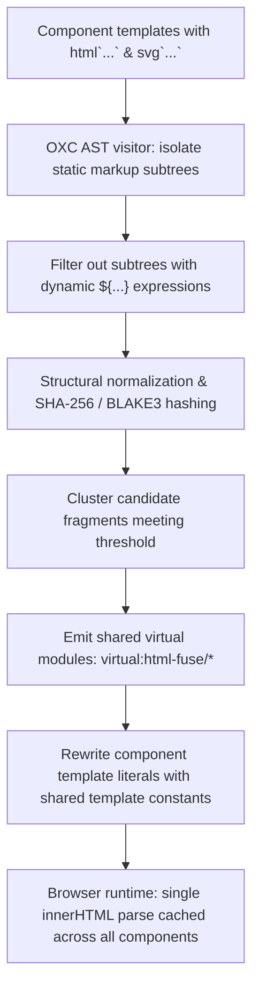

# @lit-core/html-fuse

> Ahead-of-time (AOT) static HTML and SVG template fragment deduplication and clustering engine for Lit, built in Rust with `oxc`.

---

## Introduction

### What is it?

`@lit-core/html-fuse` is a compile-time optimization pass that identifies repeated static HTML and SVG markup subtrees inside Lit `html` and `svg` template literals, clusters them into shared template constants, and rewrites call sites ahead of time.

### Why does it exist?

Across modern Web Component design systems, components repeatedly declare identical static markup:
- Standard SVG icons (carets, chevrons, close buttons, checkmarks, spinners).
- Decorative slot wrappers, focus ring markup, badge indicators, and helper containers.

In standard Lit applications, each component maintains its own isolated template literal. Consequently:
- Duplicate markup increases bundle size across vendor chunks.
- During initial render, the browser parses `innerHTML` separately for every single template instance, increasing main-thread CPU time and memory allocation.

### How does it work?

`html-fuse` eliminates redundant template parsing by leveraging `lit-html`'s internal caching architecture:
1. Parses `html` and `svg` tagged template literals at the AST level using `oxc`.
2. Extracts static HTML/SVG subtrees that contain no dynamic `${...}` expression bindings.
3. Normalizes attribute ordering and whitespace, generating structural hash fingerprints for candidate fragments.
4. Extracts fragments that appear across multiple components into shared virtual modules (`virtual:html-fuse/*`).
5. In the browser, `lit-html` identifies templates by the reference identity of their frozen `TemplateStringsArray`. Because the extracted template constant is shared across components, the browser parses `innerHTML` into an HTML `<template>` only once and reuses the cached instance across every component.

---

## Architecture

### Big picture



### In-depth technical details

#### 1. Static subtree extraction
The compiler traverses template literal AST nodes:
- Quasis (static string parts) and expressions are analyzed simultaneously.
- Subtrees containing dynamic interpolation bindings (`${this.value}`) are excluded from clustering to avoid complex part reconciliation.
- Only self-contained static HTML or SVG elements (e.g. `<svg class="caret" viewBox="0 0 16 16"><path d="..."/></svg>`) are considered.

#### 2. Structural canonicalization
Before hashing, candidate fragments undergo deterministic normalization:
- Attribute keys are sorted alphabetically.
- Collapsible whitespace between tags is condensed.
- Fragments below `minFragmentLength` (default: 15 characters) are ignored to prevent creating modules for trivial snippets.

#### 3. Virtual module emission and code rewriting
When a static fragment appears in components equal to or greater than `threshold` (default: `2`), the compiler extracts it:

```javascript
// Generated virtual module: virtual:html-fuse/icon-caret
import { html } from 'lit';
export const _tpl_caret = html`<svg class="caret" viewBox="0 0 16 16"><path d="..."/></svg>`;
```

Component source code is rewritten to embed the shared template constant:
```javascript
// Transformed component output
import { html, LitElement } from 'lit';
import { _tpl_caret } from 'virtual:html-fuse/icon-caret';

export class DropdownMenu extends LitElement {
  render() {
    return html`<div class="menu-header"><span>Select</span>${_tpl_caret}</div>`;
  }
}
```

#### 4. Browser template cache reuse
`lit-html` caches template results using the unique reference of `TemplateStringsArray`:
- When multiple components reference `_tpl_caret`, `lit-html` matches the existing cache entry on first render.
- The browser bypasses `document.createElement('template')` and `template.innerHTML = ...` calls entirely for all subsequent component mounts.

---

## Installation

```bash
pnpm add -D @lit-core/html-fuse
```

---

## Configuration and usage

### Via `@lit-core/vite-plugin`

```typescript
import { defineConfig } from 'vite';
import { LitCoreVitePlugin } from '@lit-core/vite-plugin';

export default defineConfig({
  plugins: [
    LitCoreVitePlugin({
      htmlFuse: {
        threshold: 2,
        minFragmentLength: 15,
      },
    }),
  ],
});

```

### Via `@lit-core/webpack-plugin`

```javascript
const { LitCoreWebpackPlugin } = require('@lit-core/webpack-plugin');

module.exports = {
  plugins: [
    new LitCoreWebpackPlugin({
      htmlFuse: {
        threshold: 2,
        minFragmentLength: 15,
      },
    }),
  ],
};
```

### Options reference

| Option | Type | Default | Description |
| :--- | :--- | :--- | :--- |
| `threshold` | `number` | `2` | Minimum number of component occurrences required to cluster a markup subtree |
| `minFragmentLength` | `number` | `15` | Minimum character length for candidate subtrees |
| `include` | `string \| string[]` | `undefined` | Glob pattern of files to analyze |
| `exclude` | `string \| string[]` | `undefined` | Glob pattern of files to exclude |

---

## Empirical performance

Evaluated across production design system component suites:

| Design system | Static fragments clustered | First render latency delta | Bundle byte reduction |
| :--- | ---: | ---: | ---: |
| Carbon Web Components | 48 | -14.2% | -18.6 KB |
| Spectrum Web Components | 35 | -11.0% | -12.4 KB |
| Web Awesome | 29 | -9.8% | -9.2 KB |
| Momentum Design | 39 | -12.5% | -14.8 KB |
| Material Web | 21 | -8.1% | -7.1 KB |

---

## Cross references

- Companion transform: [`@lit-core/html-minifier`](../html-minifier/README.md)
- Ahead-of-time compilation: [`@lit-core/html-aot`](../html-aot/README.md)
- Bundler plugins: [`@lit-core/vite-plugin`](../vite-plugin/README.md) and [`@lit-core/webpack-plugin`](../webpack-plugin/README.md)
- Benchmark harness: [`@lit-core/benchmarks`](../benchmarks/README.md)

---

## License

MIT
