# @lit-core/html-minifier

> Native Rust ahead-of-time (AOT) HTML and SVG template minifier for Lit and Web Components, powered by `oxc`.

---

## Introduction

### What is it?

`@lit-core/html-minifier` is a compile-time optimizer that compresses HTML and SVG markup inside Lit `html` and `svg` tagged template literals ahead of time using native Rust and `oxc`.

### Why does it exist?

Lit components define declarative templates inside JavaScript template strings:
```typescript
render() {
  return html`
    <div class="card">
      <!-- User profile header -->
      <h2 class="title">${this.name}</h2>
    </div>
  `;
}
```
Standard JavaScript minifiers (Terser, esbuild) treat template literals as opaque strings:
- They cannot strip HTML comments or collapse formatting indentation between tags.
- They risk breaking whitespace-sensitive elements (such as `<pre>` or `<code>`) if naive string replacement is attempted.
- Unminified HTML template formatting adds 3.5% to 6.0% superfluous bytes to production bundles.

### How does it work?

`html-minifier` performs HTML-aware AST compression at build time:
1. Traverses component files using `oxc` to locate `html` and `svg` tagged template literals.
2. Tokenizes the markup into tags, attributes, comments, text nodes, and dynamic expression slots.
3. Collapses redundant inter-tag whitespace and removes HTML comments.
4. Strictly preserves formatting within whitespace-sensitive elements (`<pre>`, `<code>`, `<textarea>`).
5. Rewrites the template quasis directly in the AST, emitting compact markup with zero runtime overhead.

---

## Architecture

### Big picture

```mermaid
flowchart TD
    A["Lit component with html`...` & svg`...` templates"] --> B["OXC AST visitor: locate HTML/SVG template literals"]
    B --> C["HTML tokenization: tags, attributes, text, and ${...} slots"]
    C --> D["Context verification: detect <pre>, <code>, <textarea> tags"]
    D -->|"Standard HTML element"| E["Strip HTML comments & collapse inter-tag whitespace"]
    D -->|"Preformatted element"| F["Preserve verbatim whitespace"]
    E & F --> G["Rewrite template quasis directly in AST"]
    G --> H["Compact production bundle with zero unneeded markup bytes"]
```



### In-depth technical details

#### 1. Context-aware whitespace collapsing
- Strips leading and trailing whitespace within HTML tags.
- Condenses multiple consecutive whitespace characters between tags into a single space where valid, or removes it completely when between block-level elements.
- Strips HTML comments (`<!-- ... -->`) completely from production output.

#### 2. Preformatted tag safety
Whitespace is strictly preserved inside:
- `<pre>`
- `<code>`
- `<textarea>`
- `<script>`
- `<style>`

#### 3. Interpolation slot preservation
Dynamic expression slots (`${this.value}`) often occur inside attribute values or text nodes:
- `html-minifier` handles interpolation boundaries deterministically.
- Ensures that attribute spacing (e.g. `<div id="a" class="${b}">`) is never collapsed improperly.

---

## Installation

```bash
pnpm add -D @lit-core/html-minifier
```

---

## Configuration and usage

### Via `@lit-core/vite-plugin`

```typescript
import { defineConfig } from 'vite';
import { lit } from '@lit-core/vite-plugin';

export default defineConfig({
  plugins: [
    lit({
      htmlMinifier: true,
    }),
  ],
});
```

### Via `@lit-core/webpack-plugin`

```javascript
const { LitCoreWebpackPlugin } = require('@lit-core/webpack-plugin');

module.exports = {
  plugins: [
    new LitCoreWebpackPlugin({
      htmlMinifier: true,
    }),
  ],
};
```

### Programmatic API

```typescript
import { minifyHtmlTemplate } from '@lit-core/html-minifier';

const minified = minifyHtmlTemplate(`
  <div class="container">
    <!-- Header -->
    <h1>  Title  </h1>
  </div>
`);
console.log(minified);
// Output: <div class="container"><h1> Title </h1></div>
```

---

## Empirical performance

Evaluated across production design system component suites:

| Design system | Raw template bytes | Minified template bytes | Reduction |
| :--- | ---: | ---: | ---: |
| Carbon Web Components | 342.5 KB | 323.0 KB | -5.7% |
| Spectrum Web Components | 215.0 KB | 204.2 KB | -5.0% |
| Web Awesome | 184.2 KB | 175.4 KB | -4.8% |
| Momentum Design | 260.4 KB | 246.0 KB | -5.5% |
| Material Web | 128.0 KB | 122.5 KB | -4.3% |

---

## Cross references

- Static markup clustering: [`@lit-core/html-fuse`](../html-fuse/README.md)
- CSS template minification: [`@lit-core/css-minifier`](../css-minifier/README.md)
- Bundler plugins: [`@lit-core/vite-plugin`](../vite-plugin/README.md) and [`@lit-core/webpack-plugin`](../webpack-plugin/README.md)
- Benchmark harness: [`@lit-core/benchmarks`](../benchmarks/README.md)

---

## License

MIT
