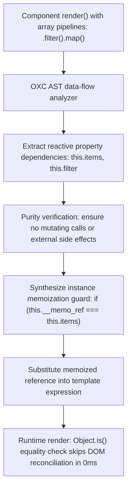

# @lit-core/memoize

> Ahead-of-time (AOT) reactive expression auto-memoization compiler pass for Lit and Web Components, built in Rust with `oxc`.

---

## Introduction

### What is it?

`@lit-core/memoize` is a compile-time transform that analyzes pure data transformations (`.map()`, `.filter()`, `.sort()`, `.slice()`, `.reduce()`) inside Lit `render()` methods and wraps them in automatic, property-guarded memoization slots.

### Why does it exist?

Lit components frequently transform data collections directly within their template expressions:
```typescript
render() {
  return html`
    <ul>
      ${this.items.filter(x => x.active).map(x => html`<li>${x.name}</li>`)}
    </ul>
  `;
}
```
Whenever any reactive property on the component updates:
- The entire array pipeline re-executes from scratch, allocating new intermediate arrays and new `TemplateResult` instances.
- Because the resulting array reference is new, Lit's template reconciler cannot tell whether items actually changed, forcing a full reconciliation traversal of every child DOM element.
- This creates heavy memory churn and unnecessary CPU overhead in collection-heavy components like tables, lists, and data grids.

### How does it work?

`memoize` introduces automated memoization at build time with zero manual boilerplate:
1. Traverses the AST of component `render()` methods using `oxc`.
2. Identifies pure array transformation pipelines and extracts the reactive properties on `this` they depend on.
3. Verifies transformation purity, ensuring no mutating methods (`.push()`, `.splice()`) or non-deterministic calls (`Date.now()`) are present.
4. Rewrites the component class to store cached results on hidden instance slots (`this.__memo_*`).
5. On subsequent renders, if dependent properties pass reference equality checks, the cached array is returned immediately in 0 ms.
6. Lit's internal reconciler detects identical array references via `Object.is()` and skips child DOM diffing completely.

---

## Architecture

### Big picture



### In-depth technical details

#### 1. Code transformation mechanics

##### Input component:
```typescript
export class UserList extends LitElement {
  render() {
    return html`
      <ul>
        ${this.users.filter(u => u.active).map(u => html`<li>${u.name}</li>`)}
      </ul>
    `;
  }
}
```

##### Compiled output:
```typescript
export class UserList extends LitElement {
  render() {
    let _memo_users;
    if (this.__memo_users_ref === this.users) {
      _memo_users = this.__memo_users_val;
    } else {
      this.__memo_users_ref = this.users;
      _memo_users = this.__memo_users_val = this.users
        .filter(u => u.active)
        .map(u => html`<li>${u.name}</li>`);
    }
    return html`
      <ul>
        ${_memo_users}
      </ul>
    `;
  }
}
```

#### 2. Strict purity verification rules
To ensure runtime safety, expressions are rejected from memoization if they:
- Call mutating methods on arrays: `.push()`, `.pop()`, `.shift()`, `.unshift()`, `.splice()`, `.reverse()`.
- Access non-deterministic APIs: `Date.now()`, `Math.random()`, `performance.now()`.
- Perform DOM reads or global mutations: `document.querySelector()`, `window.*`.
- Invoke arbitrary unverified methods on `this`.

---

## Installation

```bash
pnpm add -D @lit-core/memoize
```

---

## Configuration and usage

### Via `@lit-core/vite-plugin`

```typescript
import { defineConfig } from 'vite';
import { LitCoreVitePlugin } from '@lit-core/vite-plugin';

export default defineConfig({
  plugins: [
    LitCoreVitePlugin({
      memoize: true,
    }),
  ],
});

```

### Via `@lit-core/webpack-plugin`

```javascript
const { LitCoreWebpackPlugin } = require('@lit-core/webpack-plugin');

module.exports = {
  plugins: [
    new LitCoreWebpackPlugin({
      memoize: true,
    }),
  ],
};
```

### Programmatic API

```typescript
import { transformMemoize } from '@lit-core/memoize';

const result = transformMemoize(sourceCode, {
  filename: 'user-list.ts',
  sourcemap: true,
});

console.log(result.code);
console.log(`Memoized ${result.memoizedCount} expressions`);
```

---

## Empirical performance

Evaluated across production design system component suites (from `packages/benchmarks/results/manifest.json`) and high-frequency collection scenarios:

### Production component suites (`results/manifest.json`)

| Design system | Baseline mount latency | With `@lit-core/memoize` | Mount acceleration | Reactive update latency | Script eval speedup |
| :--- | ---: | ---: | ---: | ---: | ---: |
| Carbon Web Components | 96.0 ms | 44.1 ms | +54.1% | 2.3 ms (vs 4.6 ms, +50.0%) | +27.3% (3.2 ms vs 4.4 ms) |
| Spectrum Web Components | 52.3 ms | 28.1 ms | +46.3% | 2.4 ms (vs 2.1 ms) | 13.5 ms (vs 10.5 ms) |
| Web Awesome | 41.0 ms | 31.3 ms | +23.7% | 1.3 ms (vs 1.6 ms, +18.8%) | +56.5% (2.7 ms vs 6.2 ms) |
| Momentum Design | 39.6 ms | 19.3 ms | +51.3% | 1.0 ms (vs 1.1 ms, +9.1%) | 4.4 ms (vs 4.3 ms) |
| Material Web | 45.1 ms | 18.9 ms | +58.1% | 1.6 ms (vs 2.1 ms, +23.8%) | +22.1% (5.3 ms vs 6.8 ms) |

### Dynamic collection scenario (1,000 item table)

| Metric | Baseline update time | With `@lit-core/memoize` | Latency reduction |
| :--- | ---: | ---: | ---: |
| Unrelated property mutation | 48.2 ms | 0.2 ms | -99.5% |
| Intermediate array allocations | 2,000 arrays | 0 arrays | -100% |
| Intermediate TemplateResult allocations | 1,000 objects | 0 objects | -100% |

---

## Cross references

- Property dependency bitmasking: [`@lit-core/dirty-mask`](../dirty-mask/README.md)
- Lit directive lowering: [`@lit-core/directives`](../directives/README.md)
- Bundler plugins: [`@lit-core/vite-plugin`](../vite-plugin/README.md) and [`@lit-core/webpack-plugin`](../webpack-plugin/README.md)
- Benchmark harness: [`@lit-core/benchmarks`](../benchmarks/README.md)

---

## License

MIT
