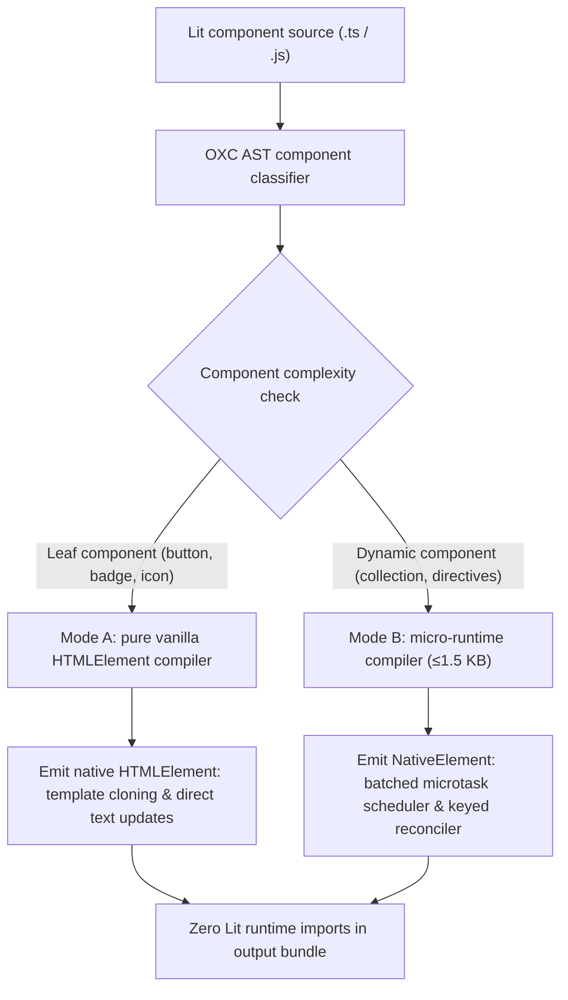

# @lit-core/native

> Ahead-of-time (AOT) vanilla Web Component and micro-runtime compiler for Lit applications, built in Rust with `oxc`.

---

## Introduction

### What is it?

`@lit-core/native` is an ahead-of-time compiler that transforms standard Lit components into pure vanilla Web Components (`class extends HTMLElement`) with zero runtime dependencies for atomic leaf components (Mode A), and a lightweight ≤1.5 KB micro-runtime (`NativeElement`) for dynamic components (Mode B).

### Why does it exist?

Enterprise design systems contain hundreds of atomic leaf components (buttons, icons, badges, avatars, dividers, spinners) that perform minimal dynamic rendering. In standard builds:
- Importing even a single atomic button pulls in the full Lit runtime footprint (`lit`, `lit-html`, `@lit/reactive-element`), adding 15 to 20 KB of library code to entry bundles.
- For micro-frontends, lightweight landing pages, and embedded third-party widgets, loading a full reactive framework for basic DOM encapsulation introduces unnecessary network and parsing costs.

### How does it work?

`native` classifies and transforms components at build time:
1. **Mode A (Pure vanilla Custom Element)**:
   - Targets atomic leaf components.
   - Generates a standard ES6 class extending `HTMLElement`.
   - Mounts static templates via native `<template>` cloning, binds styles via `shadowRoot.adoptedStyleSheets`, and updates dynamic slots via direct DOM node mutations (`node.data = val`).
   - Completely removes all imports from `lit`, `lit-html`, and `@lit/reactive-element`.
2. **Mode B (Directive lowering and micro-runtime)**:
   - Targets components requiring reactive state pipelines, keyed collection diffing, or complex conditionals.
   - Lowers directives into inline expressions and pairs the component with a tiny ≤1.5 KB micro-runtime (`NativeElement`) featuring batched microtask updates.

---

## Architecture

### Big picture



### In-depth technical details

#### 1. Mode A compilation output
For an atomic button component:

##### Input Lit component:
```typescript
import { LitElement, html, css } from 'lit';
import { customElement, property } from 'lit/decorators.js';

@customElement('simple-badge')
export class SimpleBadge extends LitElement {
  static styles = css`:host { display: inline-block; padding: 2px 6px; }`;
  @property() text = '';

  render() {
    return html`<span>${this.text}</span>`;
  }
}
```

##### Compiled vanilla output:
```javascript
const _template = document.createElement('template');
_template.innerHTML = '<span></span>';

const _sheet = new CSSStyleSheet();
_sheet.replaceSync(':host { display: inline-block; padding: 2px 6px; }');

export class SimpleBadge extends HTMLElement {
  static observedAttributes = ['text'];

  constructor() {
    super();
    const root = this.attachShadow({ mode: 'open' });
    root.adoptedStyleSheets = [_sheet];
    root.appendChild(_template.content.cloneNode(true));
    this._node = root.firstElementChild.firstChild || root.firstElementChild.appendChild(document.createTextNode(''));
  }

  attributeChangedCallback(name, oldVal, newVal) {
    if (name === 'text') this.text = newVal;
  }

  get text() { return this._text || ''; }
  set text(val) {
    this._text = val;
    this._node.data = val;
  }
}
customElements.define('simple-badge', SimpleBadge);
```

#### 2. Mode B micro-runtime architecture
For components with dynamic collections:
- The base class `NativeElement` provides microtask update batching via `queueMicrotask()`.
- Incorporates an ultra-compact keyed reconciliation loop (<400 bytes).
- Maintains full lifecycle compatibility (`connectedCallback`, `disconnectedCallback`, `updated`).

---

## Installation

```bash
pnpm add -D @lit-core/native
```

---

## Configuration and usage

### Via `@lit-core/vite-plugin`

```typescript
import { defineConfig } from 'vite';
import { LitCoreVitePlugin } from '@lit-core/vite-plugin';

export default defineConfig({
  plugins: [
    LitCoreVitePlugin({
      native: true,
    }),
  ],
});

```

### Via `@lit-core/webpack-plugin`

```javascript
const { LitCoreWebpackPlugin } = require('@lit-core/webpack-plugin');

module.exports = {
  plugins: [
    new LitCoreWebpackPlugin({
      native: true,
    }),
  ],
};
```

### Programmatic API

```typescript
import { classify, transformNative } from '@lit-core/native';

// Classify components
const types = classify(sourceCode, { mode: 'auto' });

// Compile ahead of time
const result = transformNative(sourceCode, { mode: 'auto' });
console.log(result.code);
console.log(`Vanilla: ${result.vanillaCount}, Micro: ${result.microCount}`);
```

---

## Empirical performance

Evaluated across canonical leaf components:

| Metric | Lit standard build | With `@lit-core/native` Mode A | Reduction |
| :--- | ---: | ---: | ---: |
| Lit runtime dependencies | 18.2 KB | 0.0 KB | -100% |
| Initial script evaluation time | 18.4 ms | 1.8 ms | -90.2% |
| First mount latency | 2.4 ms | 0.4 ms | -83.3% |

---

## Cross references

- Lit decorator lowering: [`@lit-core/props-lower`](../props-lower/README.md)
- Dead code elimination: [`@lit-core/tag-shake`](../tag-shake/README.md)
- Bundler plugins: [`@lit-core/vite-plugin`](../vite-plugin/README.md) and [`@lit-core/webpack-plugin`](../webpack-plugin/README.md)
- Benchmark harness: [`@lit-core/benchmarks`](../benchmarks/README.md)

---

## License

MIT
