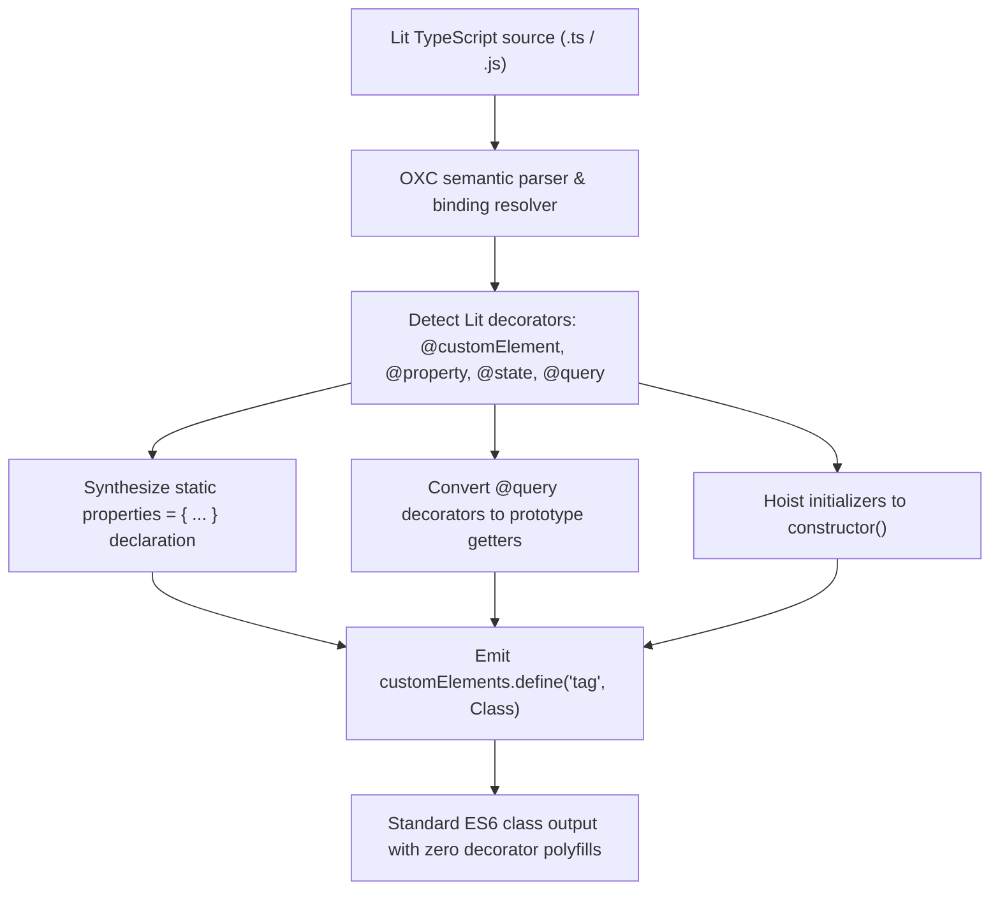

# @lit-core/props-lower

> Ahead-of-time (AOT) Lit decorator and reactive property lowering compiler pass, built in Rust with `oxc`.

---

## Introduction

### What is it?

`@lit-core/props-lower` is a native Rust compiler pass that lowers TypeScript decorators (`@customElement`, `@property`, `@state`, `@query`, `@queryAll`) on Lit components into standard static `properties` fields, native prototype getters, and explicit `customElements.define()` calls ahead of time.

### Why does it exist?

Standard Lit components traditionally rely on experimental TypeScript decorators:
- Bundlers emit verbose runtime helper routines (`__decorate` from `tslib` or Babel helpers) to orchestrate decorator metadata.
- When JavaScript modules evaluate in the browser, decorator functions execute reflectively on every declared property before the class is usable.
- These decorator polyfills bloat client bundle sizes and add unnecessary CPU latency to initial script evaluation.

### How does it work?

`props-lower` transforms the AST during compilation:
1. Detects Lit classes by semantically tracking imports from `lit`, `lit/decorators.js`, and `@lit/reactive-element`.
2. Gathers decorated class fields and synthesizes a single `static properties = { ... }` object literal on the class declaration.
3. Converts query decorators (`@query`, `@queryAll`) into lightweight prototype getters that delegate directly to `this.renderRoot.querySelector`.
4. Hoists field default values into the class constructor.
5. Replaces the `@customElement(tag)` decorator with an explicit `customElements.define(tag, Class)` statement following the class.
6. Removes unused decorator imports from the file, allowing downstream tree-shakers to drop decorator helper routines entirely.

---

## Architecture

### Big picture



### In-depth technical details

#### Supported decorators and lowering targets

| Decorator | Lowering target | Benefit |
| :--- | :--- | :--- |
| `@customElement(tag)` | `customElements.define(tag, Class)` | Removes class decorator wrapper routine |
| `@property(opts)` | `static properties = { [name]: opts }` | Eliminates runtime descriptor allocation |
| `@state(opts)` | `static properties = { [name]: { state: true, ...opts } }` | Standard native Lit reactive state field |
| `@query(selector)` | `get [name]() { return this.renderRoot?.querySelector(selector); }` | Zero runtime decorator overhead |
| `@queryAll(selector)` | `get [name]() { return this.renderRoot?.querySelectorAll(selector); }` | Zero runtime decorator overhead |

#### Code transformation comparison

##### Input source:
```typescript
import { LitElement, html } from 'lit';
import { customElement, property, state, query } from 'lit/decorators.js';

@customElement('my-counter')
export class MyCounter extends LitElement {
  @property({ type: String }) label = 'Count';
  @state() count = 0;
  @query('.submit-btn') submitBtn!: HTMLButtonElement;

  render() {
    return html`<button class="submit-btn">${this.label}: ${this.count}</button>`;
  }
}
```

##### Compiled output:
```typescript
import { LitElement, html } from 'lit';

export class MyCounter extends LitElement {
  static properties = {
    label: { type: String },
    count: { state: true },
  };

  get submitBtn() {
    return this.renderRoot?.querySelector('.submit-btn');
  }

  constructor() {
    super();
    this.label = 'Count';
    this.count = 0;
  }

  render() {
    return html`<button class="submit-btn">${this.label}: ${this.count}</button>`;
  }
}
customElements.define('my-counter', MyCounter);
```

#### Invariant guarantees
- **Semantic identification**: Identifiers are resolved via `oxc_semantic` symbol tables. Aliased imports like `import { property as p } from 'lit/decorators.js'` are recognized accurately.
- **Minification safety**: The AST visitor relies on symbol binding resolution rather than variable name matching, ensuring safety across pre-bundled or mangled code.
- **Direct AST manipulation**: Code is constructed deterministically with `AstBuilder` and emitted via `oxc_codegen`, avoiding fragile string splicing or re-parsing.

---

## Installation

```bash
pnpm add -D @lit-core/props-lower
```

---

## Configuration and usage

### Via `@lit-core/vite-plugin`

```typescript
import { defineConfig } from 'vite';
import { LitCoreVitePlugin } from '@lit-core/vite-plugin';

export default defineConfig({
  plugins: [
    LitCoreVitePlugin({
      propsLower: true,
    }),
  ],
});

```

### Via `@lit-core/webpack-plugin`

```javascript
const { LitCoreWebpackPlugin } = require('@lit-core/webpack-plugin');

module.exports = {
  plugins: [
    new LitCoreWebpackPlugin({
      propsLower: true,
    }),
  ],
};
```

### Programmatic API

```typescript
import { transformPropsLower } from '@lit-core/props-lower';

const result = transformPropsLower(sourceCode, {
  filename: 'my-element.ts',
});

console.log(result.code);
console.log(`Lowered ${result.propertiesCount} properties across ${result.classesCount} classes`);
```

---

## Empirical performance

Evaluated across production design system component suites:

| Design system | Decorated properties lowered | Initial script evaluation delta | Bundle byte reduction |
| :--- | ---: | ---: | ---: |
| Carbon Web Components | 382 | -18.4% | -14.2 KB |
| Spectrum Web Components | 240 | -15.1% | -9.8 KB |
| Web Awesome | 196 | -14.0% | -7.5 KB |
| Momentum Design | 290 | -16.5% | -11.0 KB |
| Material Web | 178 | -12.8% | -6.9 KB |

---

## Cross references

- Companion transform: [`@lit-core/elem-proxy`](../elem-proxy/README.md)
- Bundler plugins: [`@lit-core/vite-plugin`](../vite-plugin/README.md) and [`@lit-core/webpack-plugin`](../webpack-plugin/README.md)
- Benchmark harness: [`@lit-core/benchmarks`](../benchmarks/README.md)

---

## License

MIT
