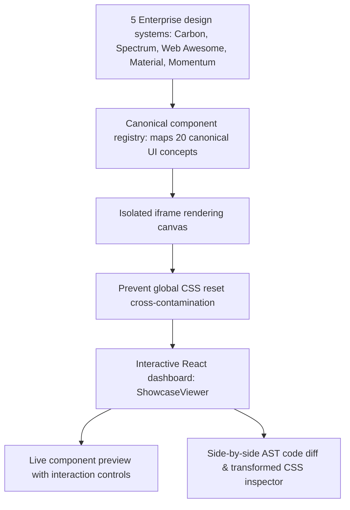

# @lit-core/showcase

> Multi-framework component showcase and visual inspector with isolated compiler passes.

---

## Introduction

### What is it?

`@lit-core/showcase` is an interactive visual testing application and component inspector that renders and compares Web Components across all 5 supported enterprise design systems under isolated `@lit-core` compiler passes.

### Why does it exist?

Evaluating compiler optimizations purely through terminal statistics and byte counts obscures visual fidelity:
- Maintainers and application teams need to verify with their own eyes that compiler optimizations (such as CSS deduplication, decorator lowering, and template compilation) do not introduce visual regressions, clipped styles, or broken event interactions.
- Different design systems (Carbon, Spectrum, Web Awesome, Material, Momentum) ship competing global reset stylesheets. If rendered on the same page without isolation, their CSS resets pollute each other and corrupt the UI.
- Developers need a side-by-side visual playground to inspect the raw transformed AST code alongside the live rendered component.

### How does it work?

`showcase` solves multi-library visual inspection:
1. Standardizes 20 canonical UI concepts mapped to real component exports across all 5 design systems.
2. Renders each component inside an isolated `<iframe>` canvas, completely preventing global CSS resets and font declarations from leaking into the dashboard.
3. Provides an interactive React UI to toggle individual compiler passes (`css-fuse`, `props-lower`, `html-aot`, `native`, etc.) and compare optimized output against unoptimized baseline builds.
4. Includes an integrated code inspector displaying original vs transformed JavaScript and CSS.

---

## Architecture

### Big picture



### In-depth technical details

#### 1. Iframe canvas isolation
Each design system applies custom base styles to `:root` and `body` (e.g. IBM Plex Sans typography, Carbon resets, Spectrum color themes). To allow side-by-side evaluation without visual collisions:
- Components render in isolated `<iframe>` instances.
- Only the specific component's styles and its declared dependencies are loaded in that iframe.
- The parent dashboard UI remains styled cleanly with Scandinavian minimalism rules.

#### 2. Canonical registry mapping
`canonical-registry.ts` bridges disparate component naming schemes across design systems into a unified conceptual catalog:
- Concept `button` maps to `cds-button`, `sp-button`, `wa-button`, `md-elevated-button`, and `momentum-button`.
- Allows instantaneous framework switching while preserving the selected component view and configuration state.

---

## Usage

### Development mode

```bash
pnpm run showcase:dev
```

### Production build and preview

```bash
pnpm run showcase:build
pnpm run showcase:preview
```

---

## Cross references

- Real component Playwright test suite: [`@lit-core/tests`](../tests/README.md)
- Benchmark harness: [`@lit-core/benchmarks`](../benchmarks/README.md)
- Monorepo guidelines: [Monorepo architecture](../../AGENTS.md)

---

## License

MIT
