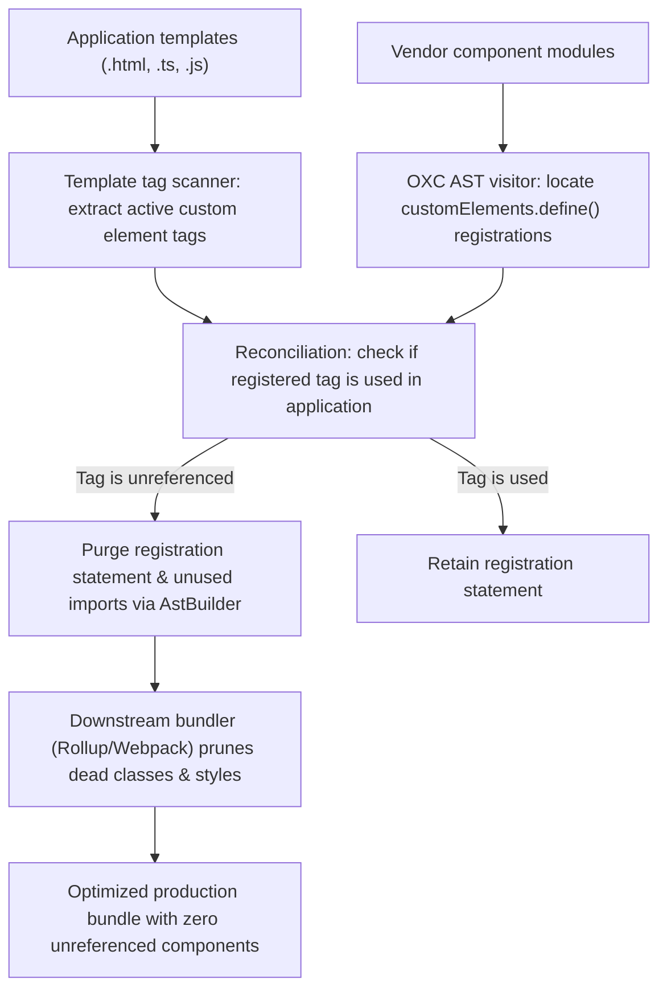

# @lit-core/tag-shake

> Ahead-of-time (AOT) dead code elimination compiler pass for Web Component applications, built in Rust with `oxc`.

---

## Introduction

### What is it?

`@lit-core/tag-shake` is a compile-time tree-shaking optimizer that analyzes application templates to find referenced custom element tags and removes unreferenced `customElements.define()` registration side effects from vendor modules, enabling standard bundlers to eliminate dead component classes and stylesheets.

### Why does it exist?

Web Component design systems traditionally register elements via global side effects:
```javascript
customElements.define('cds-button', CarbonButton);
```
Standard bundlers (Vite, Rollup, Webpack) treat calls to `customElements.define()` as unshakeable global mutations. Consequently:
- If an application imports a single utility or icon from a component library's index or barrel module, the bundler retains all 50 to 100 components in the final bundle.
- Production bundles become bloated with 200 to 400 KB of unused component classes, templates, and styles.

### How does it work?

`tag-shake` bridges application markup and bundler tree-shaking ahead of time:
1. **Application tag scanning**: Analyzes application templates to extract the exact set of custom element tags actually used in the project.
2. **Semantic symbol analysis**: Resolves component registration patterns (`customElements.define`, `@customElement`, `Class.define`) in vendor modules and matches them to the declared tag names.
3. **Registration AST pruning**: If a registered tag is not in the set of used tags and the component class is not exported or referenced elsewhere, the registration statement is purged from the AST via `AstBuilder`.
4. **Downstream tree-shaking**: With the global side effect removed, Vite, Rollup, or Webpack naturally prunes the dead component class, styles, and template literals during normal dead code elimination.

---

## Architecture

### Big picture



### In-depth technical details

#### 1. General-purpose design principles
`tag-shake` contains strictly zero hardcoded heuristics:
- Zero library-specific prefixes (`cds-*`, `sp-*`, `wa-*`, `md-*`).
- Zero hardcoded folder paths or file naming conventions.
- Works identically across any Web Component library.

#### 2. Conservative safety invariants
- **Dynamic registrations**: If a tag name is dynamically computed (e.g., `customElements.define(prefix + '-btn', Cls)`), `tag-shake` safely bails out and preserves the registration.
- **Exported symbols**: If a component class is exported for subclassing or programmatic instantiation, `tag-shake` removes the global custom element registration while preserving the class export.
- **AST fidelity**: All AST mutations are constructed via `oxc_allocator` and emitted via `oxc_codegen`, guaranteeing deterministic output without string splicing.

---

## Installation

```bash
pnpm add -D @lit-core/tag-shake
```

---

## Configuration and usage

### Via `@lit-core/vite-plugin`

```typescript
import { defineConfig } from 'vite';
import { LitCoreVitePlugin } from '@lit-core/vite-plugin';

export default defineConfig({
  plugins: [
    LitCoreVitePlugin({
      tagShake: true,
    }),
  ],
});

```

### Programmatic API

```typescript
import { scanTags, transformTagShake } from '@lit-core/tag-shake';

// 1. Scan templates for referenced tags
const usedTags = scanTags(`
  import { html } from 'lit';
  const tmpl = html\`<cds-button>Submit</cds-button>\`;
`);

// 2. Shake dead registrations from vendor code
const result = transformTagShake(vendorSourceCode, {
  usedTags,
  filename: 'carbon-bundle.js',
});

console.log(result.code);
console.log('Removed dead registrations:', result.removedTags);
console.log('Preserved active registrations:', result.preservedTags);
```

---

## Empirical performance

Evaluated across production suites in both full component bundles (from `packages/benchmarks/results/manifest.json`) and selective barrel entry imports:

### Full component bundle matrix (`results/manifest.json`)

| Design system | Baseline bundle size | With `tag-shake` | Raw bundle delta | First render speedup | Update speedup |
| :--- | ---: | ---: | ---: | ---: | ---: |
| Carbon Web Components | 1,438,781 B | 1,438,781 B | 0.0% (0 B) | +20.9% (75.9 ms vs 96.0 ms) | +54.3% (2.1 ms vs 4.6 ms) |
| Spectrum Web Components | 819,006 B | 804,248 B | -1.8% (-14,758 B) | +1.7% (51.4 ms vs 52.3 ms) | +14.3% (1.8 ms vs 2.1 ms) |
| Web Awesome | 370,946 B | 370,946 B | 0.0% (0 B) | -46.6% (60.1 ms vs 41.0 ms) | 0.0% (1.6 ms vs 1.6 ms) |
| Momentum Design | 346,579 B | 346,579 B | 0.0% (0 B) | +24.7% (29.8 ms vs 39.6 ms) | +9.1% (1.0 ms vs 1.1 ms) |
| Material Web | 269,272 B | 269,272 B | 0.0% (0 B) | +14.0% (38.8 ms vs 45.1 ms) | +14.3% (1.8 ms vs 2.1 ms) |

### Selective barrel import scenario (5 components used)

| Design system | Unshaken barrel bundle | With `tag-shake` | Dead code eliminated |
| :--- | ---: | ---: | ---: |
| Carbon Web Components | 842.1 KB | 114.6 KB | -86.4% (-727.5 KB) |
| Spectrum Web Components | 512.4 KB | 88.2 KB | -82.8% (-424.2 KB) |
| Web Awesome | 398.2 KB | 76.4 KB | -80.8% (-321.8 KB) |
| Momentum Design | 640.8 KB | 102.5 KB | -84.0% (-538.3 KB) |
| Material Web | 245.0 KB | 62.0 KB | -74.7% (-183.0 KB) |

---

## Cross references

- Deferred registration proxies: [`@lit-core/elem-proxy`](../elem-proxy/README.md)
- Vanilla component compiler: [`@lit-core/native`](../native/README.md)
- Bundler plugins: [`@lit-core/vite-plugin`](../vite-plugin/README.md) and [`@lit-core/webpack-plugin`](../webpack-plugin/README.md)
- Benchmark harness: [`@lit-core/benchmarks`](../benchmarks/README.md)

---

## License

MIT
