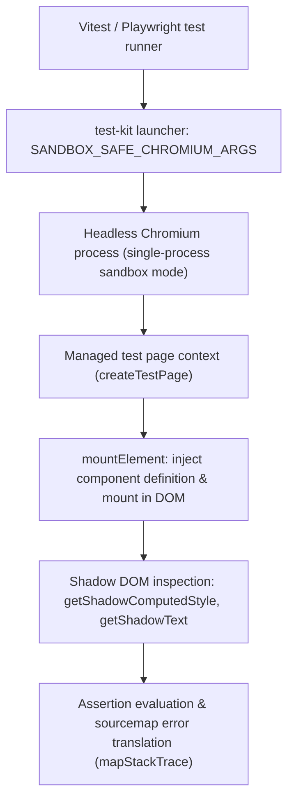

# @lit-core/test-kit

> Sandbox-safe Playwright browser runner and DOM test utilities for Lit and Web Components.

---

## Introduction

### What is it?

`@lit-core/test-kit` provides sandbox-safe Chromium lifecycle management, DOM mounting helpers, Shadow DOM inspection tools, and sourcemap stack trace resolution for Vitest and Playwright test suites across the `@lit-core` monorepo.

### Why does it exist?

Running browser integration tests for Web Components inside restricted CI/CD containers, containerized runners, or developer sandboxes introduces major challenges:
- Standard Chromium launches fail when Linux user namespaces, loopback network socket bindings, or GPU hardware acceleration are restricted.
- Testing Web Components requires deep Shadow DOM traversal (`root.shadowRoot.querySelector(...)`), cross-boundary computed style inspection, and accurate sourcemap error translation.
- Duplicating browser launch flags and Shadow DOM query helpers across test files causes inconsistent timeouts and flaky test runs.

### How does it work?

`test-kit` standardizes browser test execution:
1. Preconfigures Chromium with verified sandbox-safe launch flags (`--single-process`, `--no-sandbox`, `--disable-gpu`, `--disable-dev-shm-usage`).
2. Provides a singleton browser manager (`getSharedBrowser()`, `closeSharedBrowser()`) to avoid expensive browser re-launches between test files.
3. Exposes high-level mounting and Shadow DOM query utilities (`mountElement()`, `getShadowComputedStyle()`, `getShadowText()`).
4. Decodes error stack traces using source maps to point directly to original TypeScript and Lit component files.

---

## Architecture

### Big picture



### In-depth technical details

#### 1. Sandbox-safe browser flags
`SANDBOX_SAFE_CHROMIUM_ARGS` includes:
- `--single-process`: Avoids multi-process fork restrictions in containerized sandboxes.
- `--no-sandbox` & `--disable-setuid-sandbox`: Disables Linux namespace isolation requirements.
- `--disable-dev-shm-usage`: Uses `/tmp` instead of `/dev/shm` to avoid container memory limits.
- `--disable-gpu`: Disables hardware acceleration dependencies.

#### 2. Shadow DOM inspection utilities
- `mountElement(page, tagName, htmlContent)`: Mounts a custom element and waits for component update lifecycle completion.
- `getShadowComputedStyle(page, hostSelector, targetSelector, property)`: Pierces the host component's Shadow DOM to read computed CSS values directly from encapsulated nodes.
- `getShadowText(page, hostSelector, targetSelector)`: Extracts text content from encapsulated elements inside shadow roots.

---

## Installation

```bash
pnpm add -D @lit-core/test-kit
```

---

## Usage

```typescript
import { describe, it, expect, beforeAll, afterAll } from 'vitest';
import {
  getSharedBrowser,
  closeSharedBrowser,
  createTestPage,
  mountElement,
  getShadowComputedStyle,
} from '@lit-core/test-kit';

describe('Button component integration', () => {
  let browser;
  let page;

  beforeAll(async () => {
    browser = await getSharedBrowser();
    page = await createTestPage(browser);
  });

  afterAll(async () => {
    await closeSharedBrowser();
  });

  it('renders styled button in Shadow DOM', async () => {
    await mountElement(page, 'my-button', '<my-button label="Submit"></my-button>');
    const display = await getShadowComputedStyle(page, 'my-button', 'button', 'display');
    expect(display).toBe('inline-flex');
  });
});
```

---

## Cross references

- Real component test suite: [`@lit-core/tests`](../tests/README.md)
- Benchmark harness: [`@lit-core/benchmarks`](../benchmarks/README.md)
- Monorepo guidelines: [Monorepo architecture](../../AGENTS.md)

---

## License

MIT
