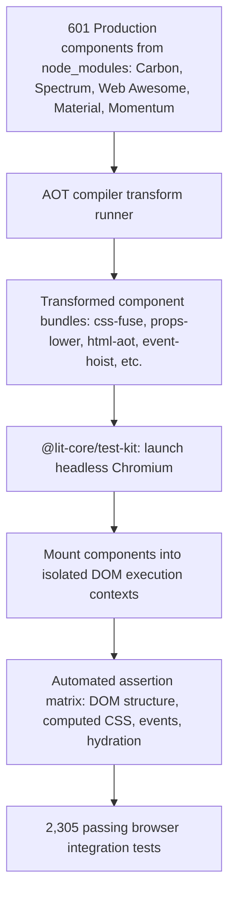

# @lit-core/tests

> Exhaustive Playwright Chromium test suite verifying `@lit-core` compiler transforms against real production component code from 5 major enterprise design systems.

---

## Introduction

### What is it?

`@lit-core/tests` is an integration test suite that verifies `@lit-core` compiler passes against 601 production Web Components from 5 industry design systems, validating DOM rendering, hydration, styling, and event handling inside real headless Chromium.

### Why does it exist?

Testing compiler transforms on synthetic code snippets or toy counter examples creates a false sense of security:
- Production component libraries feature intricate CSS inheritance, custom element lifecycles, complex decorator configurations, and nested Shadow DOM boundaries.
- A compiler bug in CSS deduplication or decorator lowering might pass synthetic tests but break layout, event dispatch, or theme tokens in real enterprise components.
- Direct verification against authentic component source code in real browser engines is essential to ensure zero regressions across production applications.

### How does it work?

The test harness runs an end-to-end verification pipeline:
1. Reads authentic component source files directly from `node_modules` for IBM Carbon, Adobe Spectrum, Web Awesome, Material Web, and Cisco Momentum.
2. Applies `@lit-core` compiler passes (such as `css-fuse`, `props-lower`, `html-aot`, `event-hoist`, `dom-paths`, `resumable`) to the real component source.
3. Launches headless Chromium using `@lit-core/test-kit` under sandbox-safe execution flags.
4. Mounts the compiled components into isolated page contexts and executes assertions covering DOM tree structure, computed CSS styles, reactive property updates, and event propagation across 2,305 automated test cases.

---

## Architecture

### Big picture



### In-depth technical details

#### 1. Real component coverage matrix

| Feature under test | Package | Test file | Verified tests |
| :--- | :--- | :--- | ---: |
| CSS deduplication | [`@lit-core/css-fuse`](../css-fuse/README.md) | `src/css-fuse.test.ts` | 260 |
| Decorator lowering | [`@lit-core/props-lower`](../props-lower/README.md) | `src/props-lower.test.ts` | 255 |
| CSS minification | [`@lit-core/css-minifier`](../css-minifier/README.md) | `src/css-minifier.test.ts` | 255 |
| HTML minification | [`@lit-core/html-minifier`](../html-minifier/README.md) | `src/html-minifier.test.ts` | 255 |
| Static HTML/SVG clustering | [`@lit-core/html-fuse`](../html-fuse/README.md) | `src/html-fuse.test.ts` | 260 |
| Lazy element proxies | [`@lit-core/elem-proxy`](../elem-proxy/README.md) | `src/elem-proxy.test.ts` | 255 |
| ShadowRoot event delegation | [`@lit-core/event-hoist`](../event-hoist/README.md) | `src/event-hoist.test.ts` | 255 |
| Ahead-of-time template compilation | [`@lit-core/html-aot`](../html-aot/README.md) | `src/html-aot.test.ts` | 255 |
| Resumable SSR and hydration | [`@lit-core/resumable`](../resumable/README.md) | `src/resumable.test.ts` | 255 |
| **Total** | **9 packages** | **9 files** | **2,305** |

#### 2. Evaluated design systems
The suite validates 601 production components in total:
- **Carbon Web Components** (`@carbon/web-components`): 284 components
- **Adobe Spectrum Web Components** (`@spectrum-web-components`): 93 components
- **Web Awesome** (`@awesome.me/webawesome`): 73 components
- **Google Material Web** (`@material/web`): 54 components
- **Cisco Momentum Design** (`@momentum-design/components`): 97 components

---

## Running the tests

Run the complete test suite across all packages:

```bash
pnpm --filter @lit-core/tests test
```

Run a specific feature test file:

```bash
npx vitest run packages/tests/src/css-fuse.test.ts
npx vitest run packages/tests/src/props-lower.test.ts
npx vitest run packages/tests/src/event-hoist.test.ts
```

---

## Cross references

- Browser test runner kit: [`@lit-core/test-kit`](../test-kit/README.md)
- Benchmark harness: [`@lit-core/benchmarks`](../benchmarks/README.md)
- Monorepo guidelines: [Monorepo architecture](../../AGENTS.md)

---

## License

MIT
