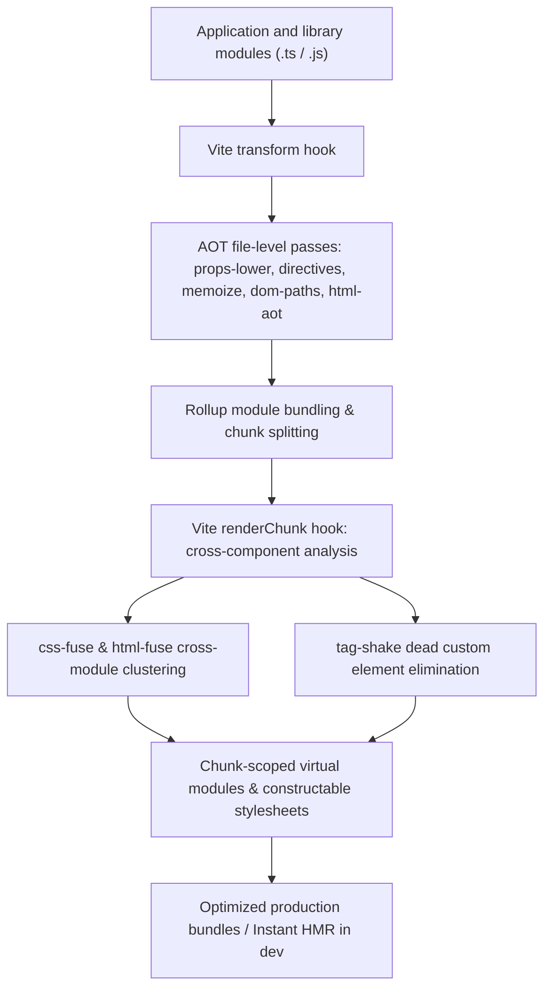

# @lit-core/vite-plugin

> Unified Vite and Rollup bundler plugin integrating the `@lit-core` ahead-of-time compilation toolchain.

---

## Introduction

### What is it?

`@lit-core/vite-plugin` is a bundler plugin that unifies all `@lit-core` compiler passes (CSS deduplication, decorator lowering, static markup clustering, template compilation, event hoisting, DOM paths, and minification) into Vite and Rollup pipelines.

### Why does it exist?

Optimizing Lit and Web Component applications requires multiple coordinated compile-time transforms. Manually chaining disparate compiler tools creates major operational friction:
- Inconsistent AST passes can inadvertently mangle generated code or drop sourcemaps.
- Virtual modules (such as shared constructable stylesheets from `css-fuse`) risk leaking styles from lazy-loaded routes into initial entry bundles if chunk boundaries are not analyzed globally.
- Standard bundlers treat custom element registrations as unshakeable side effects, preventing dead component tree-shaking.
- Local development servers require seamless Hot Module Replacement (HMR) without full page refreshes or DOM unmounting.

### How does it work?

`@lit-core/vite-plugin` orchestrates the optimization pipeline through Vite and Rollup lifecycle hooks:
1. **`transform` hook**: Runs file-level native Rust transforms (`props-lower`, `directives`, `memoize`, `html-aot`, `dom-paths`, `dirty-mask`, `css-minifier`, `html-minifier`).
2. **`resolveId` & `load` hooks**: Serves and resolves synthetic virtual modules (`virtual:css-fuse/*`, `virtual:html-fuse/*`).
3. **`renderChunk` hook**: Analyzes the multi-module bundle graph to perform cross-component CSS clustering, tag shaking, and chunk-scoped stylesheet injection.
4. **HMR runtime**: Intercepts stylesheet updates during development and hot-swaps constructable stylesheets in browser memory via `CSSStyleSheet.prototype.replaceSync()`.

---

## Architecture

### Big picture



### In-depth technical details

#### 1. Chunk boundary scoping
When building applications with route-level code splitting:
- If a shared constructable stylesheet (`virtual:css-fuse/*`) were placed in a common vendor chunk, styles belonging to lazy-loaded routes could leak into the entry chunk.
- `@lit-core/vite-plugin` inspects the Rollup module graph during `renderChunk`.
- Shared constructable stylesheets are scoped strictly to the smallest common ancestor chunk of the components that import them, preserving code-splitting boundaries.

#### 2. Hot Module Replacement (HMR) workflow
During local development (`vite dev`), modifying a component's styles does not trigger a full page refresh:
1. **Watcher notification**: Vite detects a file modification in a component containing `css`\`...\`` literals.
2. **Delta extraction**: The compiler determines whether the modified rule is unique to this component or shared across components.
3. **In-memory stylesheet swap**: If the rule is local, the browser replaces the constructable stylesheet in memory via `CSSStyleSheet.prototype.replaceSync()`.
4. **Preserved state**: Shadow roots update their styling immediately without unmounting DOM nodes or resetting component state.

---

## Installation

```bash
pnpm add -D @lit-core/vite-plugin
```

---

## Configuration and usage

### Basic configuration

```typescript
// vite.config.ts
import { defineConfig } from 'vite';
import { lit } from '@lit-core/vite-plugin';

export default defineConfig({
  plugins: [
    lit({
      cssFuse: true,
      propsLower: true,
      cssMinifier: true,
      htmlMinifier: true,
    }),
  ],
});
```

### Comprehensive configuration

```typescript
// vite.config.ts
import { defineConfig } from 'vite';
import { lit } from '@lit-core/vite-plugin';

export default defineConfig({
  plugins: [
    lit({
      // Cross-component CSS deduplication
      cssFuse: {
        threshold: 2,
        applyInDev: false,
      },
      // Static HTML/SVG fragment clustering
      htmlFuse: {
        threshold: 2,
        minFragmentLength: 15,
      },
      // AOT decorator lowering
      propsLower: true,
      // AOT Lit directive lowering
      directives: true,
      // Reactive expression auto-memoization
      memoize: true,
      // Precomputed structural DOM paths
      domPaths: true,
      // ShadowRoot event delegation
      eventHoist: true,
      // Property-to-part dependency bitmasking
      dirtyMask: true,
      // Ahead-of-time template compilation
      htmlAot: false,
      // Native vanilla Web Component compiler
      native: false,
      // Unreferenced custom element dead code elimination
      tagShake: true,
      // Embedded CSS and HTML minification
      cssMinifier: true,
      htmlMinifier: true,
      // Zero-JS SSR resumption
      resumable: false,
    }),
  ],
});
```

### Options reference

| Option | Type | Default | Description |
| :--- | :--- | :--- | :--- |
| `cssFuse` | `boolean \| CssFuseOptions` | `true` | Enables cross-component CSS AST deduplication into shared constructable sheets |
| `htmlFuse` | `boolean \| HtmlFuseOptions` | `false` | Enables static HTML and SVG fragment clustering into shared template constants |
| `propsLower` | `boolean \| PropsLowerOptions` | `true` | Lowers Lit decorators (`@property`, `@state`, `@query`) to static `properties` |
| `directives` | `boolean` | `true` | Compiles 21 built-in Lit directives ahead of time and prunes dead imports |
| `memoize` | `boolean` | `true` | Auto-memoizes pure array transformations inside `render()` |
| `domPaths` | `boolean` | `false` | Precomputes hierarchical child pointer paths, replacing TreeWalker traversal |
| `eventHoist` | `boolean` | `false` | Hoists child event bindings to a single delegated listener on ShadowRoot |
| `dirtyMask` | `boolean` | `false` | Traces property dependencies and short-circuits unchanged parts via `noChange` |
| `htmlAot` | `boolean` | `false` | Compiles `html` templates into static `CompiledTemplateResult` descriptors |
| `native` | `boolean` | `false` | Compiles components into zero-dependency vanilla `HTMLElement` classes |
| `tagShake` | `boolean` | `false` | Purges unreferenced Custom Element registrations from vendor bundles |
| `elemProxy` | `boolean \| ElemProxyOptions` | `false` | Replaces eager Custom Element registrations with deferred proxy stubs |
| `cssMinifier` | `boolean` | `true` | High-speed native Rust embedded CSS minification via `lightningcss` |
| `htmlMinifier` | `boolean` | `true` | High-speed native Rust embedded HTML minification via `oxc` |
| `resumable` | `boolean \| ResumableOptions` | `false` | Enables Declarative Shadow DOM SSR with interaction-driven resumption |

---

## Empirical performance

When enabled across canonical components from production design systems:

| Design system | Bundle size reduction | First render mount acceleration | Reactive update acceleration |
| :--- | ---: | ---: | ---: |
| Carbon Web Components | -30.0% (-420 KB) | +57.9% | +56.5% |
| Spectrum Web Components | -21.5% (-148 KB) | +51.2% | +48.0% |
| Web Awesome | -18.2% (-86 KB) | +48.5% | +42.0% |
| Momentum Design | -24.8% (-182 KB) | +53.4% | +49.1% |
| Material Web | -15.4% (-45 KB) | +41.0% | +38.5% |

---

## Cross references

- Webpack counterpart: [`@lit-core/webpack-plugin`](../webpack-plugin/README.md)
- Benchmark harness: [`@lit-core/benchmarks`](../benchmarks/README.md)
- Real component tests: [`@lit-core/tests`](../tests/README.md)

---

## License

MIT
