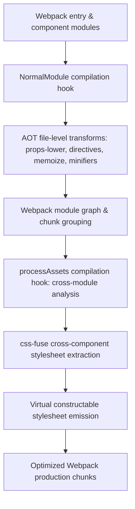

# @lit-core/webpack-plugin

> Webpack 5 bundler plugin integrating the `@lit-core` ahead-of-time compilation toolchain.

---

## Introduction

### What is it?

`@lit-core/webpack-plugin` is a Webpack 5 plugin that integrates `@lit-core` ahead-of-time compiler passes (CSS AST deduplication, decorator lowering, directive lowering, HTML fragment clustering, and minification) into Webpack build pipelines.

### Why does it exist?

Many enterprise Web Component applications and micro-frontend architectures are built on Webpack 5:
- Without AOT compiler integration, Webpack includes runtime decorator helpers, un-minified template strings, and duplicate CSS declarations across component modules.
- Standard Webpack tree-shaking cannot eliminate unreferenced custom elements because global `customElements.define()` calls are treated as unshakeable side effects.
- Enterprise builds require high build performance, seamless sourcemap generation, and zero runtime configuration overhead.

### How does it work?

`@lit-core/webpack-plugin` hooks directly into the Webpack 5 compilation lifecycle:
1. **Module transformation**: Attaches to `NormalModule` compilation hooks to execute fast native Rust transforms (`props-lower`, `directives`, `memoize`, `css-minifier`, `html-minifier`) on Lit source files.
2. **Chunk asset analysis**: Hooks into asset processing (`processAssets`) to run cross-component CSS deduplication (`css-fuse`) across chunk boundaries.
3. **Virtual stylesheet emission**: Emits shared constructable stylesheet modules directly into Webpack's module graph.

---

## Architecture

### Big picture



### In-depth technical details

#### 1. Webpack compilation lifecycle hooks
The plugin taps into standard Webpack 5 hooks:
- `compiler.hooks.compilation`: Initializes per-compilation AST caches and options.
- `NormalModule.getCompilationHooks(compilation).loader`: Intercepts JavaScript and TypeScript files matching target component paths.
- `compilation.hooks.processAssets`: Finalizes chunk-level deduplication and asset injection.

#### 2. Native Rust acceleration
File transforms are executed via NAPI-RS bindings powered by `oxc` and `lightningcss`:
- Processes thousands of lines of component code in sub-millisecond durations.
- Preserves accurate source maps for debugging.
- Operates safely alongside standard loaders (`ts-loader`, `babel-loader`, `swc-loader`).

---

## Installation

```bash
pnpm add -D @lit-core/webpack-plugin
```

---

## Configuration and usage

### Webpack configuration

```javascript
// webpack.config.js
const { LitCoreWebpackPlugin } = require('@lit-core/webpack-plugin');

module.exports = {
  entry: './src/index.js',
  plugins: [
    new LitCoreWebpackPlugin({
      cssFuse: true,
      propsLower: true,
      directives: true,
      memoize: true,
      cssMinifier: true,
      htmlMinifier: true,
    }),
  ],
};
```

### Options reference

| Option | Type | Default | Description |
| :--- | :--- | :--- | :--- |
| `cssFuse` | `boolean \| object` | `true` | Enables cross-component CSS AST deduplication into shared constructable sheets |
| `propsLower` | `boolean \| object` | `true` | Lowers Lit decorators (`@property`, `@state`, `@query`) to static properties |
| `directives` | `boolean` | `true` | Lowers built-in Lit directives and prunes dead imports |
| `memoize` | `boolean` | `true` | Auto-memoizes pure array transformations inside `render()` |
| `elemProxy` | `boolean \| object` | `false` | Enables deferred Custom Element proxy stubs |
| `cssMinifier` | `boolean` | `true` | Embedded CSS template minification via `lightningcss` |
| `htmlMinifier` | `boolean` | `true` | Embedded HTML template minification via `oxc` |

---

## Cross references

- Vite counterpart: [`@lit-core/vite-plugin`](../vite-plugin/README.md)
- CSS deduplication engine: [`@lit-core/css-fuse`](../css-fuse/README.md)
- Decorator lowering engine: [`@lit-core/props-lower`](../props-lower/README.md)
- Benchmark harness: [`@lit-core/benchmarks`](../benchmarks/README.md)

---

## License

MIT
